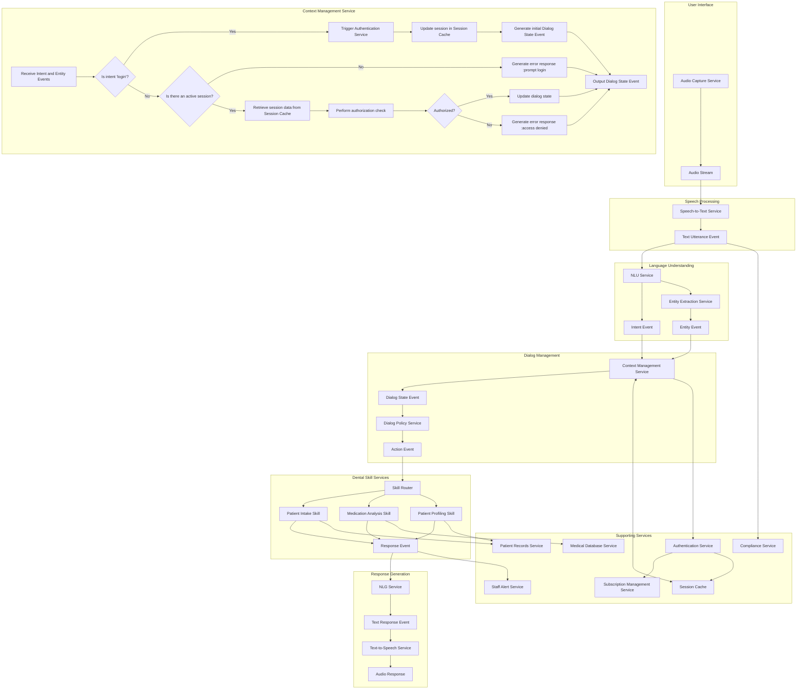

# Dental Care SaaS Platform

A multi-tenant subscription-based platform providing agentic assistance for dental care offices.


## Introduction

The AI Voice Assistant for Dental Clinics is a cutting-edge tool designed to streamline operations, enhance patient care, and boost efficiency in dental practices. Leveraging advanced voice recognition and automation, it supports dentists, staff, and patients across clinical, administrative, and business workflows. This document outlines the comprehensive feature set of the assistant.

## Features

### Clinical Workflows
- **Voice Recognition for Capturing Dentist Notes and Advice**  
  Allows hands-free dictation of notes, treatment plans, and advice, transcribed and stored in patient records for efficiency.

- **Integration with Dental Imaging Systems**  
  Provides voice-activated access to X-rays, intraoral images, or 3D scans, with voice command annotations.

- **Treatment Planning and Progress Tracking**  
  Enables creation, updates, and tracking of multi-visit treatment plans, tailored for specialties like orthodontics or implantology.

- **Voice-Activated Equipment Control**  
  Offers hands-free control of dental chairs, lights, or CAD/CAM systems, maintaining sterility and streamlining workflows.

- **Automated Documentation and Transcription**  
  Transcribes patient histories, findings, and consent forms into structured data, including dental charting support.

- **Emergency and Safety Protocols**  
  Grants voice access to emergency protocols and real-time alerts for critical patient data beyond allergies.

### Patient Care and Engagement
- **Patient Profile Management with Allergy Tracking**  
  Stores detailed patient profiles with medical history, allergies, and preferences for personalized, safe care.

- **Automated Notifications for Drug Allergies and Contraindications**  
  Alerts staff to drug allergies or contraindications, enhancing safety during treatment and prescribing.

- **Patient Communication Automation**  
  Automates appointment reminders, follow-ups, and oral health tips to improve engagement and adherence.

- **Patient Education Tools**  
  Delivers voice-activated educational content or visual aids to explain procedures and conditions.

- **Teledentistry and Remote Care**  
  Supports virtual consultations and remote oral health monitoring via video calls or patient apps.

- **Patient Engagement Features**  
  Sends personalized hygiene reminders and automates post-visit satisfaction surveys.

- **Specialty-Specific Patient Tools**  
  Includes gamification for pediatric dentistry or virtual smile previews for cosmetic dentistry.

### Administrative and Operational Efficiency
- **Inventory and Supply Chain Management**  
  Tracks supply levels via voice commands and automates reordering based on usage.

- **Insurance and Billing Integration**  
  Verifies insurance eligibility, submits claims, and integrates with accounting for seamless billing.

- **Staff and Resource Management**  
  Manages staff schedules, operatory assignments, and tracks credentials or training requirements.

- **Automated Appointment Scheduling**  
  Enables online or voice-based booking with confirmations and optimized scheduling.

### Business Management and Growth
- **Reporting and Analytics**  
  Generates performance reports (e.g., no-shows, revenue) for data-driven insights.

- **Marketing and Patient Acquisition**  
  Automates recall campaigns and integrates with review platforms to boost reputation.

- **Membership and Loyalty Program Management**  
  Tracks dental membership benefits, renewals, and patient notifications.

### Security, Compliance, and Scalability
- **Multi-Tenant Architecture with Subscription Management**  
  Supports multiple clinics with isolated data and subscription-based access for scalability.

- **Enhanced Data Security and Compliance**  
  Uses voice biometrics and ensures HIPAA/GDPR compliance with encryption and audits.

- **Data Backup and Disaster Recovery**  
  Automates backups and recovery to safeguard patient data.

- **Multi-Language and Global Adaptability**  
  Supports multiple languages and adapts to regional standards for global use.

### User Experience and Support
- **Intuitive Interface and Customization**  
  Offers a user-friendly design with customizable voice commands and natural language support.

- **Training and Support**  
  Provides onboarding tutorials, voice-guided help, and responsive customer support.

## Conclusion

The AI Voice Assistant for Dental Clinics delivers a holistic solution, addressing clinical, patient, administrative, and business needs. By integrating these features, it enhances productivity, improves patient outcomes, and drives practice success.

---


# AI Voice Assistant Architecture


## Architecture Overview

This platform follows a microservices architecture with the following components:

- **Frontend**: React/Next.js web application, React Native mobile apps
- **Backend Services**: Node.js/Express microservices
- **AI Components**: Voice processing, NLP, and agentic assistance
- **Data Storage**: PostgreSQL, MongoDB, and object storage
- **Infrastructure**: Docker, Kubernetes, CI/CD pipelines

## Project Structure

```
dental-saas/
├── frontend/         # Frontend applications
│   ├── web/          # Web application for dental staff
│   ├── mobile/       # Mobile apps for staff and patients
│   └── admin/        # Admin dashboard
├── backend/          # Backend services
│   ├── services/     # Microservices
│   ├── shared/       # Shared libraries and utilities
│   └── database/     # Database schemas and migrations
├── infrastructure/   # Infrastructure as code
│   ├── kubernetes/   # K8s configuration
│   ├── docker/       # Docker configurations
│   └── terraform/    # Infrastructure provisioning
└── docs/             # Documentation
    ├── architecture/ # Architecture diagrams and decisions
    ├── api/          # API documentation
    └── deployment/   # Deployment guides
```

## Getting Started

1. Clone this repository
2. Set up development environment (see docs/development-setup.md)
3. Run the development environment with Docker Compose

## Development Roadmap

See [ROADMAP.md](./ROADMAP.md) for the current development plan and milestones.

## License

[Specify your license]
