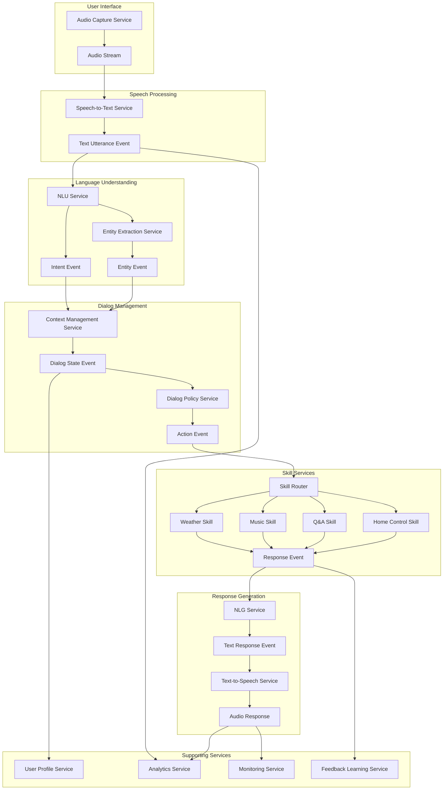

# Dental Care SaaS Platform

A multi-tenant subscription-based platform providing agentic assistance for dental care offices.

## Features

- Voice recognition for capturing dentist notes and advice
- Patient profile management with allergy tracking
- Automated notifications for drug allergies and contraindications
- Patient communication automation
- Multi-tenant architecture with subscription management

# AI Voice Assistant Architecture



## Architecture Overview

This platform follows a microservices architecture with the following components:

- **Frontend**: React/Next.js web application, React Native mobile apps
- **Backend Services**: Node.js/Express microservices
- **AI Components**: Voice processing, NLP, and agentic assistance
- **Data Storage**: PostgreSQL, MongoDB, and object storage
- **Infrastructure**: Docker, Kubernetes, CI/CD pipelines

## Project Structure

```
dental-saas/
├── frontend/         # Frontend applications
│   ├── web/          # Web application for dental staff
│   ├── mobile/       # Mobile apps for staff and patients
│   └── admin/        # Admin dashboard
├── backend/          # Backend services
│   ├── services/     # Microservices
│   ├── shared/       # Shared libraries and utilities
│   └── database/     # Database schemas and migrations
├── infrastructure/   # Infrastructure as code
│   ├── kubernetes/   # K8s configuration
│   ├── docker/       # Docker configurations
│   └── terraform/    # Infrastructure provisioning
└── docs/             # Documentation
    ├── architecture/ # Architecture diagrams and decisions
    ├── api/          # API documentation
    └── deployment/   # Deployment guides
```

## Getting Started

1. Clone this repository
2. Set up development environment (see docs/development-setup.md)
3. Run the development environment with Docker Compose

## Development Roadmap

See [ROADMAP.md](./ROADMAP.md) for the current development plan and milestones.

## License

[Specify your license]
