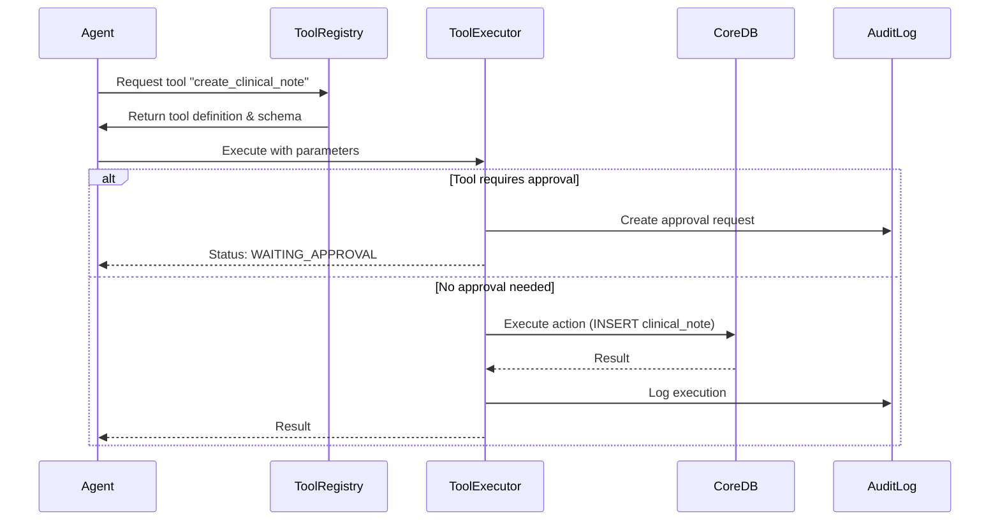
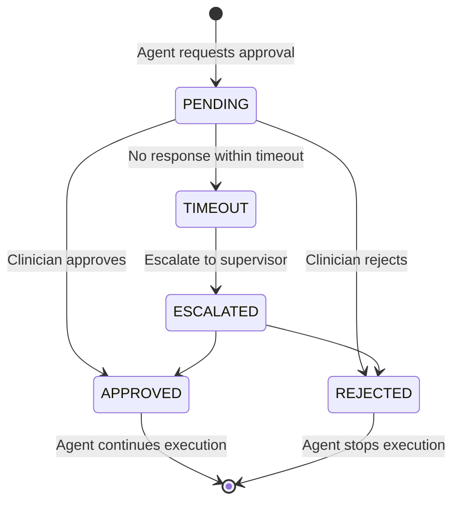

# AI Agent Architecture & Schema Design

## Overview

This document describes the **AI Agent Infrastructure** that extends the core clinical data schema (`schema-core.md`) to support modern AI agent frameworks like LangGraph, AutoGen, and CrewAI.

**Related Documents:**
- `schema-core.md` - Core clinical and operational schema (human-readable)
- `schema-core.yaml` - Core schema specification (machine-readable)
- `schema-agent-extensions.yaml` - AI agent infrastructure extensions

---

## Architecture Principles

### 1. Layered Design

```
┌─────────────────────────────────────────────────────┐
│  AI Agent Layer (schema-agent-extensions.yaml)     │
│  - Workflow orchestration                           │
│  - Tool execution                                   │
│  - Multi-agent collaboration                        │
│  - Memory & context management                      │
└─────────────────────────────────────────────────────┘
                        ↓ builds on
┌─────────────────────────────────────────────────────┐
│  Core Clinical Layer (schema-core.yaml)             │
│  - Patients, encounters, imaging                    │
│  - Voice sessions & utterances                      │
│  - AI predictions & models                          │
│  - Audit & compliance                               │
└─────────────────────────────────────────────────────┘
```

### 2. Integration Points

The AI agent layer **extends** (not replaces) the core schema through these key integration points:

| Core Schema Table | Agent Extension | Purpose |
|-------------------|-----------------|---------|
| `voice_sessions` | `agent_executions` | Link voice commands to workflows |
| `api_clients` | `agent_executions` | Identify which agent is executing |
| `users` | `agent_approval_requests` | Human-in-the-loop approvals |
| `patients` | `agent_executions` | Patient context for workflows |
| `encounters` | `agent_executions` | Clinical visit context |
| `audit_events` | `agent_steps` | Audit trail for agent actions |

---

## Schema Components

### 1. Workflow Orchestration (LangGraph Pattern)

**Purpose:** Define and execute multi-step agent workflows as state graphs.

#### Tables

**`agent_workflows`** - Reusable workflow definitions
```yaml
Example:
  name: "Voice-Activated Clinical Note Creation"
  workflow_type: CONVERSATIONAL
  graph_definition:
    nodes:
      - name: "parse_intent"
        type: LLM_CALL
      - name: "extract_clinical_data"
        type: TOOL_CALL
      - name: "create_note"
        type: TOOL_CALL
      - name: "require_approval"
        type: HUMAN_APPROVAL
    edges:
      - from: "parse_intent"
        to: "extract_clinical_data"
        condition: "intent == 'create_note'"
```

**`agent_executions`** - Runtime workflow instances
```yaml
Example:
  workflow_id: "workflow-uuid"
  voice_session_id: "session-uuid"
  patient_id: "patient-uuid"
  current_node: "require_approval"
  status: WAITING_APPROVAL
  state_snapshot:
    patient_id: "..."
    encounter_id: "..."
    note_content: "Patient presents with..."
    extracted_diagnoses: ["D0120", "D0220"]
```

**`agent_steps`** - Individual step executions
```yaml
Example Step 1 (LLM Call):
  node_name: "parse_intent"
  node_type: LLM_CALL
  llm_provider: OPENAI
  llm_model: gpt-4
  prompt_tokens: 150
  completion_tokens: 20
  output_state:
    intent: "create_note"
    confidence: 0.95

Example Step 2 (Tool Call):
  node_name: "create_note"
  node_type: TOOL_CALL
  tool_name: "create_clinical_note"
  tool_input:
    encounter_id: "..."
    content: "..."
  tool_output:
    note_id: "..."
    status: "success"
```

#### Integration with Core Schema

```sql
-- Link voice command → workflow execution → clinical note
SELECT 
  vu.transcript,
  ae.status as workflow_status,
  cn.content as created_note
FROM voice_utterances vu
JOIN agent_executions ae ON ae.voice_session_id = vu.session_id
JOIN agent_steps ast ON ast.execution_id = ae.id
JOIN clinical_notes cn ON cn.id = (ast.tool_output->>'note_id')::uuid
WHERE vu.intent = 'create_note';
```

---

### 2. Tool/Function Registry & Execution

**Purpose:** Define available tools and track their execution by agents.

#### Tables

**`agent_tools`** - Tool registry
```yaml
Example:
  name: "create_clinical_note"
  description: "Create a clinical note for a patient encounter"
  category: DATA_MUTATION
  function_schema:
    type: object
    properties:
      encounter_id: { type: string, format: uuid }
      note_type: { type: string, enum: [SOAP, RADIOLOGY_REPORT] }
      content: { type: string }
    required: [encounter_id, content]
  implementation_type: INTERNAL_SERVICE
  endpoint_uri: "/api/v1/clinical-notes"
  requires_approval: false
  timeout_ms: 5000
```

**`tool_executions`** - Individual tool calls
```yaml
Example:
  tool_id: "create_clinical_note"
  agent_step_id: "step-uuid"
  input_params:
    encounter_id: "enc-123"
    note_type: "SOAP"
    content: "S: Patient reports tooth pain..."
  output_result:
    note_id: "note-456"
    created_at: "2024-01-15T10:30:00Z"
  status: SUCCEEDED
  duration_ms: 234
```

#### Common Tools for Dental AI Agents

| Tool Name | Category | Requires Approval | Use Case |
|-----------|----------|-------------------|----------|
| `get_patient_history` | DATA_RETRIEVAL | No | Retrieve patient medical/dental history |
| `search_clinical_knowledge` | DATA_RETRIEVAL | No | Search clinical protocols, evidence |
| `create_clinical_note` | DATA_MUTATION | No | Create SOAP/progress notes |
| `update_dental_chart` | DATA_MUTATION | Yes | Modify tooth chart |
| `schedule_appointment` | DATA_MUTATION | No | Book patient appointments |
| `order_imaging` | DATA_MUTATION | Yes | Order X-rays, CBCT |
| `create_treatment_plan` | DATA_MUTATION | Yes | Generate treatment plans |
| `submit_insurance_claim` | EXTERNAL_API | Yes | Submit claims to payers |
| `calculate_risk_score` | COMPUTATION | No | Calculate caries/perio risk |
| `send_patient_message` | NOTIFICATION | No | Send SMS/email to patient |

#### Tool Execution Flow



---

### 3. Multi-Agent Collaboration (AutoGen/CrewAI Pattern)

**Purpose:** Enable multiple specialized agents to collaborate on complex tasks.

#### Tables

**`agent_conversations`** - Multi-agent threads
```yaml
Example:
  conversation_type: HIERARCHICAL
  initiator_type: USER
  patient_id: "patient-uuid"
  encounter_id: "encounter-uuid"
  status: ACTIVE
```

**`agent_messages`** - Agent-to-agent messages
```yaml
Example Message 1 (User → Diagnostic Agent):
  sender_type: USER
  sender_id: "user-uuid"
  recipient_type: API_CLIENT
  recipient_id: "diagnostic-agent-uuid"
  message_type: TEXT
  content: "Analyze this patient's X-rays for caries"

Example Message 2 (Diagnostic Agent → Treatment Agent):
  sender_type: API_CLIENT
  sender_id: "diagnostic-agent-uuid"
  recipient_type: API_CLIENT
  recipient_id: "treatment-agent-uuid"
  message_type: FUNCTION_CALL
  function_call:
    name: "create_treatment_plan"
    arguments:
      patient_id: "..."
      diagnoses: ["D0220", "D2391"]
```

#### Multi-Agent Patterns

**1. Sequential (Pipeline)**
```
User → Agent A → Agent B → Agent C → User
Example: Diagnostic → Treatment Planning → Billing
```

**2. Hierarchical (Supervisor)**
```
         Supervisor Agent
         /      |      \
    Agent A  Agent B  Agent C
Example: Supervisor delegates to specialists
```

**3. Peer-to-Peer (Collaborative)**
```
Agent A ←→ Agent B ←→ Agent C
Example: Diagnostic, Treatment, and Billing agents collaborate
```

**4. Group Chat (Broadcast)**
```
    Agent A
       ↓
    Group Chat ← Agent B
       ↓
    Agent C
Example: Case review with multiple specialists
```

#### Example: Comprehensive Treatment Planning Crew

```yaml
Conversation:
  type: HIERARCHICAL
  agents:
    - name: "Supervisor Agent"
      role: Orchestrator
      
    - name: "Diagnostic Agent"
      role: Analyze imaging, identify pathology
      tools: [analyze_xray, detect_caries, assess_bone_loss]
      
    - name: "Treatment Planning Agent"
      role: Create treatment plans
      tools: [create_treatment_plan, estimate_costs]
      
    - name: "Insurance Agent"
      role: Check coverage, pre-authorizations
      tools: [check_eligibility, estimate_coverage]
      
    - name: "Scheduling Agent"
      role: Book appointments
      tools: [check_availability, schedule_appointment]

Flow:
  1. User: "Create comprehensive treatment plan for patient John Doe"
  2. Supervisor → Diagnostic: "Analyze patient's recent imaging"
  3. Diagnostic → Supervisor: "Found: 3 caries, moderate bone loss"
  4. Supervisor → Treatment: "Create plan for these findings"
  5. Treatment → Supervisor: "Plan created, estimated cost $4,500"
  6. Supervisor → Insurance: "Check coverage for this plan"
  7. Insurance → Supervisor: "Coverage: 80% basic, 50% major, $1,500 deductible"
  8. Supervisor → Scheduling: "Book initial appointment"
  9. Scheduling → Supervisor: "Booked for Jan 25, 2:00 PM"
  10. Supervisor → User: "Treatment plan ready, appointment scheduled"
```

---

### 4. Memory & Context Management (RAG Pattern)

**Purpose:** Enable agents to remember facts, retrieve relevant context, and optimize token usage.

#### Tables

**`agent_memories`** - Long-term memory with semantic search
```yaml
Example Memory 1 (Patient Preference):
  memory_type: PREFERENCE
  scope: PATIENT
  scope_id: "patient-uuid"
  content: "Patient prefers morning appointments, anxious about needles"
  embedding: [0.123, -0.456, 0.789, ...] # 1536-dim vector
  source_type: VOICE_UTTERANCE
  importance_score: 0.8

Example Memory 2 (Clinical Fact):
  memory_type: FACT
  scope: PATIENT
  scope_id: "patient-uuid"
  content: "Patient has history of endocarditis, requires antibiotic prophylaxis"
  embedding: [0.234, -0.567, 0.890, ...]
  source_type: CLINICAL_NOTE
  importance_score: 1.0
```

**`agent_context_windows`** - Context optimization
```yaml
Example:
  execution_id: "exec-uuid"
  context_items:
    - type: PATIENT_HISTORY
      content: "Patient demographics, allergies, medications"
      tokens: 150
    - type: RECENT_ENCOUNTERS
      content: "Last 3 visits summary"
      tokens: 200
    - type: RELEVANT_MEMORIES
      content: "Retrieved from semantic search"
      tokens: 100
  total_tokens: 450
  max_tokens: 8000
  pruning_strategy: IMPORTANCE
```

#### Semantic Search with pgvector

```sql
-- Find relevant memories for current patient context
SELECT 
  content,
  importance_score,
  1 - (embedding <=> query_embedding) as similarity
FROM agent_memories
WHERE tenant_id = :tenant_id
  AND scope = 'PATIENT'
  AND scope_id = :patient_id
ORDER BY embedding <=> :query_embedding
LIMIT 5;
```

#### Context Window Management

```python
# Pseudo-code for context optimization
def build_context(patient_id, max_tokens=8000):
    context = []
    tokens_used = 0
    
    # 1. Always include critical info (high importance)
    critical = get_memories(
        patient_id, 
        importance_score__gte=0.9
    )
    context.extend(critical)
    tokens_used += sum(m.token_count for m in critical)
    
    # 2. Add semantically relevant info
    query_embedding = embed("current conversation context")
    relevant = semantic_search(
        patient_id,
        query_embedding,
        limit=10
    )
    
    for memory in relevant:
        if tokens_used + memory.token_count <= max_tokens:
            context.append(memory)
            tokens_used += memory.token_count
        else:
            break
    
    # 3. Summarize if still over limit
    if tokens_used > max_tokens:
        context = summarize(context, target_tokens=max_tokens)
    
    return context
```

---

### 5. Human-in-the-Loop (HITL)

**Purpose:** Ensure clinical safety by requiring human approval for high-risk actions.

#### Tables

**`agent_approval_requests`** - Pending approvals
```yaml
Example:
  execution_id: "exec-uuid"
  tool_execution_id: "tool-exec-uuid"
  requested_action: "Update dental chart - mark tooth #14 as extracted"
  action_details:
    tooth_number: "14"
    status: "EXTRACTED"
    reason: "Non-restorable caries"
  reason: "Permanent change to patient record"
  priority: HIGH
  assigned_to_user_id: "dentist-uuid"
  status: PENDING
  timeout_at: "2024-01-15T11:00:00Z"
```

**`agent_interventions`** - Human corrections
```yaml
Example:
  execution_id: "exec-uuid"
  intervention_type: CORRECT
  original_action:
    tool: "create_treatment_plan"
    diagnosis: "D2391" # Resin-based composite - one surface
  corrected_action:
    diagnosis: "D2392" # Resin-based composite - two surfaces
  reason: "Agent misidentified number of surfaces involved"
  use_for_training: true
```

#### Approval Workflow



#### Approval Rules Configuration

```yaml
# Example approval rules
approval_rules:
  - tool: "update_dental_chart"
    requires_approval: true
    approval_roles: [DENTIST]
    timeout_minutes: 30
    
  - tool: "create_treatment_plan"
    requires_approval: true
    approval_roles: [DENTIST, CLINICAL_SUPERVISOR]
    approval_threshold: 1  # Only 1 approval needed
    timeout_minutes: 60
    
  - tool: "order_imaging"
    requires_approval: true
    approval_roles: [DENTIST]
    timeout_minutes: 15
    
  - tool: "create_clinical_note"
    requires_approval: false  # Auto-approved, but logged
    
  - tool: "schedule_appointment"
    requires_approval: false
```

---

## Complete Workflow Example: Voice-Activated Clinical Note

### Scenario
Dentist says: *"Create a note for John Doe's appointment today. Patient presented with pain in upper right quadrant. Diagnosed caries on tooth 3. Recommended composite filling."*

### Step-by-Step Execution

#### 1. Voice Capture (Core Schema)

```sql
-- voice_sessions
INSERT INTO voice_sessions (tenant_id, user_id, patient_id, channel)
VALUES ('tenant-123', 'dentist-456', 'patient-789', 'MOBILE_APP');

-- voice_utterances
INSERT INTO voice_utterances (session_id, sequence_no, speaker, transcript, intent, entities)
VALUES (
  'session-uuid',
  1,
  'USER',
  'Create a note for John Doe...',
  'create_clinical_note',
  '{"patient_name": "John Doe", "tooth_number": "3", "diagnosis": "caries", "treatment": "composite filling"}'
);
```

#### 2. Workflow Initiation (Agent Schema)

```sql
-- agent_executions
INSERT INTO agent_executions (
  workflow_id, 
  tenant_id, 
  api_client_id,
  voice_session_id,
  user_id,
  patient_id,
  current_node,
  state_snapshot
)
VALUES (
  'workflow-clinical-note',
  'tenant-123',
  'voice-agent-client',
  'session-uuid',
  'dentist-456',
  'patient-789',
  'parse_intent',
  '{
    "utterance_id": "utterance-uuid",
    "raw_transcript": "Create a note for John Doe...",
    "extracted_entities": {...}
  }'
);
```

#### 3. Step 1: Parse Intent (LLM Call)

```sql
-- agent_steps
INSERT INTO agent_steps (
  execution_id,
  sequence_no,
  node_name,
  node_type,
  llm_provider,
  llm_model,
  prompt_tokens,
  completion_tokens,
  output_state
)
VALUES (
  'exec-uuid',
  1,
  'parse_intent',
  'LLM_CALL',
  'OPENAI',
  'gpt-4',
  180,
  50,
  '{
    "intent": "create_clinical_note",
    "confidence": 0.96,
    "entities": {
      "patient_id": "patient-789",
      "tooth_number": "3",
      "diagnosis_code": "D0220",
      "treatment_code": "D2391"
    }
  }'
);
```

#### 4. Step 2: Retrieve Patient Context (Tool Call)

```sql
-- tool_executions
INSERT INTO tool_executions (
  agent_step_id,
  tool_id,
  tenant_id,
  api_client_id,
  input_params,
  output_result,
  status,
  duration_ms
)
VALUES (
  'step-uuid',
  'get_patient_history',
  'tenant-123',
  'voice-agent-client',
  '{"patient_id": "patient-789"}',
  '{
    "allergies": ["Penicillin"],
    "medications": ["Lisinopril 10mg"],
    "medical_conditions": ["Hypertension"],
    "last_visit": "2023-12-01"
  }',
  'SUCCEEDED',
  156
);

-- agent_steps
INSERT INTO agent_steps (
  execution_id,
  sequence_no,
  node_name,
  node_type,
  tool_name,
  tool_input,
  tool_output
)
VALUES (
  'exec-uuid',
  2,
  'retrieve_context',
  'TOOL_CALL',
  'get_patient_history',
  '{"patient_id": "patient-789"}',
  '{"allergies": [...], "medications": [...]}'
);
```

#### 5. Step 3: Generate Structured Note (LLM Call)

```sql
-- agent_steps
INSERT INTO agent_steps (
  execution_id,
  sequence_no,
  node_name,
  node_type,
  llm_provider,
  llm_model,
  prompt_tokens,
  completion_tokens,
  output_state
)
VALUES (
  'exec-uuid',
  3,
  'generate_note',
  'LLM_CALL',
  'OPENAI',
  'gpt-4',
  450,
  200,
  '{
    "note_content": "S: Patient reports pain in upper right quadrant...\nO: Clinical exam reveals caries on tooth #3...\nA: Caries, tooth #3 (D0220)\nP: Composite filling recommended (D2391)"
  }'
);
```

#### 6. Step 4: Create Clinical Note (Tool Call)

```sql
-- tool_executions
INSERT INTO tool_executions (
  agent_step_id,
  tool_id,
  input_params,
  output_result,
  status
)
VALUES (
  'step-uuid',
  'create_clinical_note',
  '{
    "encounter_id": "encounter-uuid",
    "note_type": "SOAP",
    "content": "S: Patient reports pain..."
  }',
  '{"note_id": "note-uuid", "created_at": "2024-01-15T10:30:00Z"}',
  'SUCCEEDED'
);

-- Core schema: clinical_notes
INSERT INTO clinical_notes (
  id,
  encounter_id,
  author_id,
  note_type,
  content,
  signed_at
)
VALUES (
  'note-uuid',
  'encounter-uuid',
  'dentist-456',
  'SOAP',
  'S: Patient reports pain in upper right quadrant...',
  NOW()
);
```

#### 7. Audit Trail (Core Schema)

```sql
-- audit_events
INSERT INTO audit_events (
  tenant_id,
  actor_type,
  actor_id,
  event_type,
  resource_type,
  resource_id,
  metadata
)
VALUES (
  'tenant-123',
  'API_CLIENT',
  'voice-agent-client',
  'CLINICAL_NOTE_CREATED',
  'CLINICAL_NOTE',
  'note-uuid',
  '{
    "voice_session_id": "session-uuid",
    "voice_utterance_id": "utterance-uuid",
    "agent_execution_id": "exec-uuid",
    "workflow_name": "Voice-Activated Clinical Note",
    "llm_calls": 2,
    "tool_calls": 2,
    "total_duration_ms": 2340
  }'
);
```

#### 8. Workflow Completion

```sql
-- agent_executions (UPDATE)
UPDATE agent_executions
SET 
  current_node = 'completed',
  status = 'COMPLETED',
  completed_at = NOW()
WHERE id = 'exec-uuid';

-- agent_metrics
INSERT INTO agent_metrics (execution_id, tenant_id, metric_name, metric_value)
VALUES 
  ('exec-uuid', 'tenant-123', 'COMPLETION_TIME', 2.34),
  ('exec-uuid', 'tenant-123', 'TOKEN_COST', 0.023),
  ('exec-uuid', 'tenant-123', 'TOOL_CALLS', 2),
  ('exec-uuid', 'tenant-123', 'USER_SATISFACTION', 5.0);
```

---

## Query Patterns & Analytics

### 1. Agent Performance Dashboard

```sql
-- Average workflow completion time by type
SELECT 
  w.workflow_type,
  COUNT(*) as execution_count,
  AVG(EXTRACT(EPOCH FROM (ae.completed_at - ae.started_at))) as avg_duration_seconds,
  COUNT(*) FILTER (WHERE ae.status = 'COMPLETED') * 100.0 / COUNT(*) as success_rate
FROM agent_executions ae
JOIN agent_workflows w ON ae.workflow_id = w.id
WHERE ae.started_at > NOW() - INTERVAL '30 days'
GROUP BY w.workflow_type;
```

### 2. Tool Usage & Success Rates

```sql
-- Most used tools and their performance
SELECT 
  t.name,
  t.category,
  COUNT(*) as execution_count,
  AVG(te.duration_ms) as avg_duration_ms,
  COUNT(*) FILTER (WHERE te.status = 'SUCCEEDED') * 100.0 / COUNT(*) as success_rate,
  COUNT(*) FILTER (WHERE te.status = 'FAILED') as failure_count
FROM tool_executions te
JOIN agent_tools t ON te.tool_id = t.id
WHERE te.started_at > NOW() - INTERVAL '7 days'
GROUP BY t.id, t.name, t.category
ORDER BY execution_count DESC;
```

### 3. Human Intervention Analysis

```sql
-- How often do humans correct agent actions?
SELECT 
  w.name as workflow_name,
  COUNT(DISTINCT ae.id) as total_executions,
  COUNT(DISTINCT ai.id) as interventions,
  COUNT(DISTINCT ai.id) * 100.0 / COUNT(DISTINCT ae.id) as intervention_rate,
  ai.intervention_type,
  COUNT(*) as count_by_type
FROM agent_executions ae
JOIN agent_workflows w ON ae.workflow_id = w.id
LEFT JOIN agent_interventions ai ON ai.execution_id = ae.id
WHERE ae.started_at > NOW() - INTERVAL '30 days'
GROUP BY w.name, ai.intervention_type
ORDER BY intervention_rate DESC;
```

### 4. Voice-to-Action Traceability

```sql
-- Trace voice command → workflow → actions → outcomes
SELECT 
  vu.transcript as voice_command,
  vu.intent,
  w.name as workflow_name,
  ae.status as workflow_status,
  json_agg(
    json_build_object(
      'step', ast.node_name,
      'type', ast.node_type,
      'tool', ast.tool_name,
      'duration_ms', ast.duration_ms
    ) ORDER BY ast.sequence_no
  ) as steps,
  ae.completed_at - ae.started_at as total_duration
FROM voice_utterances vu
JOIN agent_executions ae ON ae.voice_session_id = vu.session_id
JOIN agent_workflows w ON ae.workflow_id = w.id
JOIN agent_steps ast ON ast.execution_id = ae.id
WHERE vu.session_id = :session_id
GROUP BY vu.id, w.name, ae.id;
```

### 5. LLM Cost Tracking

```sql
-- Calculate LLM costs per tenant per month
SELECT 
  ae.tenant_id,
  DATE_TRUNC('month', ast.created_at) as month,
  ast.llm_provider,
  ast.llm_model,
  SUM(ast.prompt_tokens) as total_prompt_tokens,
  SUM(ast.completion_tokens) as total_completion_tokens,
  -- Pricing example (adjust for actual rates)
  SUM(
    CASE ast.llm_model
      WHEN 'gpt-4' THEN 
        ast.prompt_tokens * 0.00003 + ast.completion_tokens * 0.00006
      WHEN 'gpt-3.5-turbo' THEN
        ast.prompt_tokens * 0.000001 + ast.completion_tokens * 0.000002
      ELSE 0
    END
  ) as estimated_cost_usd
FROM agent_steps ast
JOIN agent_executions ae ON ast.execution_id = ae.id
WHERE ast.node_type = 'LLM_CALL'
  AND ast.created_at > NOW() - INTERVAL '90 days'
GROUP BY ae.tenant_id, month, ast.llm_provider, ast.llm_model
ORDER BY month DESC, estimated_cost_usd DESC;
```

### 6. Approval Queue for Clinicians

```sql
-- Pending approvals for a specific clinician
SELECT 
  apr.id,
  apr.requested_action,
  apr.action_details,
  apr.priority,
  p.first_name || ' ' || p.last_name as patient_name,
  w.name as workflow_name,
  NOW() - apr.created_at as waiting_time,
  apr.timeout_at
FROM agent_approval_requests apr
JOIN agent_executions ae ON apr.execution_id = ae.id
JOIN agent_workflows w ON ae.workflow_id = w.id
LEFT JOIN patients p ON ae.patient_id = p.id
WHERE apr.assigned_to_user_id = :user_id
  AND apr.status = 'PENDING'
ORDER BY apr.priority DESC, apr.created_at ASC;
```

---

## Performance Optimization

### 1. Indexing Strategy

```sql
-- Critical indexes for agent queries
CREATE INDEX CONCURRENTLY idx_agent_executions_active 
ON agent_executions (tenant_id, status, started_at)
WHERE status IN ('RUNNING', 'WAITING_APPROVAL');

CREATE INDEX CONCURRENTLY idx_agent_steps_execution_time
ON agent_steps (execution_id, created_at DESC);

CREATE INDEX CONCURRENTLY idx_tool_executions_recent
ON tool_executions (tenant_id, tool_id, started_at DESC)
WHERE started_at > NOW() - INTERVAL '30 days';

CREATE INDEX CONCURRENTLY idx_approval_requests_pending
ON agent_approval_requests (tenant_id, assigned_to_user_id, priority, created_at)
WHERE status = 'PENDING';

-- pgvector index for semantic search
CREATE INDEX CONCURRENTLY idx_agent_memories_embedding
ON agent_memories USING ivfflat (embedding vector_cosine_ops)
WITH (lists = 100);
```

### 2. Partitioning

```sql
-- Partition agent_steps by month (high volume)
CREATE TABLE agent_steps (
  id uuid NOT NULL DEFAULT uuid_generate_v4(),
  execution_id uuid NOT NULL,
  created_at timestamptz NOT NULL DEFAULT now(),
  -- ... other columns
) PARTITION BY RANGE (created_at);

-- Create monthly partitions
CREATE TABLE agent_steps_2024_01 
PARTITION OF agent_steps
FOR VALUES FROM ('2024-01-01') TO ('2024-02-01');

CREATE TABLE agent_steps_2024_02 
PARTITION OF agent_steps
FOR VALUES FROM ('2024-02-01') TO ('2024-03-01');
```

### 3. Archival Strategy

```sql
-- Archive completed executions older than 90 days
CREATE TABLE agent_executions_archive (
  LIKE agent_executions INCLUDING ALL
);

-- Move to archive
WITH archived AS (
  DELETE FROM agent_executions
  WHERE completed_at < NOW() - INTERVAL '90 days'
    AND status IN ('COMPLETED', 'FAILED', 'CANCELLED')
  RETURNING *
)
INSERT INTO agent_executions_archive
SELECT * FROM archived;
```

---

## Security & Compliance

### 1. Agent Permission Scoping

```sql
-- Check if agent has permission to execute tool
CREATE FUNCTION check_agent_tool_permission(
  p_api_client_id uuid,
  p_tool_name text
) RETURNS boolean AS $$
  SELECT EXISTS (
    SELECT 1
    FROM api_clients ac
    JOIN agent_tools at ON at.name = p_tool_name
    WHERE ac.id = p_api_client_id
      AND (
        -- Global client has access to all tools
        ac.tenant_id IS NULL
        OR
        -- Tenant-scoped client has access to tenant tools
        (ac.tenant_id = at.tenant_id OR at.tenant_id IS NULL)
      )
      AND (
        -- Check scopes
        ac.scopes IS NULL
        OR
        ac.scopes @> jsonb_build_array(at.category)
      )
      AND at.is_active = true
  );
$$ LANGUAGE sql SECURITY DEFINER;
```

### 2. PHI Protection in Agent State

```sql
-- Trigger to validate state_snapshot doesn't contain raw PHI
CREATE FUNCTION validate_agent_state_phi() RETURNS trigger AS $$
BEGIN
  -- Check for common PHI fields that shouldn't be in state
  IF NEW.state_snapshot ? 'ssn' 
     OR NEW.state_snapshot ? 'patient_name'
     OR NEW.state_snapshot ? 'dob' THEN
    RAISE EXCEPTION 'State snapshot contains raw PHI. Use references instead.';
  END IF;
  
  RETURN NEW;
END;
$$ LANGUAGE plpgsql;

CREATE TRIGGER check_agent_state_phi
  BEFORE INSERT OR UPDATE ON agent_executions
  FOR EACH ROW EXECUTE FUNCTION validate_agent_state_phi();
```

### 3. Audit Completeness

```sql
-- Ensure all agent actions are audited
CREATE FUNCTION ensure_agent_audit() RETURNS trigger AS $$
BEGIN
  -- When a tool execution completes, create audit event
  IF NEW.status = 'SUCCEEDED' AND OLD.status != 'SUCCEEDED' THEN
    INSERT INTO audit_events (
      tenant_id,
      actor_type,
      actor_id,
      event_type,
      resource_type,
      resource_id,
      metadata
    )
    SELECT
      NEW.tenant_id,
      'API_CLIENT',
      NEW.api_client_id,
      'TOOL_EXECUTED',
      'TOOL_EXECUTION',
      NEW.id,
      jsonb_build_object(
        'tool_id', NEW.tool_id,
        'agent_step_id', NEW.agent_step_id,
        'duration_ms', NEW.duration_ms
      );
  END IF;
  
  RETURN NEW;
END;
$$ LANGUAGE plpgsql;

CREATE TRIGGER audit_tool_execution
  AFTER UPDATE ON tool_executions
  FOR EACH ROW EXECUTE FUNCTION ensure_agent_audit();
```

---

## Migration & Deployment

### Phase 1: Core Infrastructure (Week 1-2)

```sql
-- Deploy workflow and tool tables
\i schema-agent-extensions-phase1.sql

-- Tables: agent_workflows, agent_executions, agent_steps, 
--         agent_tools, tool_executions
```

**Validation:**
```sql
-- Verify tables exist
SELECT table_name 
FROM information_schema.tables 
WHERE table_schema = 'public' 
  AND table_name LIKE 'agent_%';

-- Test basic workflow
INSERT INTO agent_workflows (...) VALUES (...);
INSERT INTO agent_executions (...) VALUES (...);
```

### Phase 2: HITL (Week 3)

```sql
-- Deploy approval tables
\i schema-agent-extensions-phase2.sql

-- Tables: agent_approval_requests, agent_interventions
```

### Phase 3: Multi-Agent (Week 4)

```sql
-- Deploy collaboration tables
\i schema-agent-extensions-phase3.sql

-- Tables: agent_conversations, agent_messages
```

### Phase 4: Memory & RAG (Week 5-6)

```sql
-- Install pgvector extension
CREATE EXTENSION IF NOT EXISTS vector;

-- Deploy memory tables
\i schema-agent-extensions-phase4.sql

-- Tables: agent_memories, agent_context_windows, agent_metrics
```

---

## Monitoring & Observability

### Key Metrics to Track

1. **Workflow Performance**
   - Completion rate: Target >95%
   - Average duration: Target <30s
   - Error rate: Target <2%

2. **Tool Execution**
   - Success rate: Target >98%
   - Average latency: Target <500ms
   - Timeout rate: Target <1%

3. **LLM Usage**
   - Tokens per execution
   - Cost per workflow
   - Model performance (latency, quality)

4. **Human Intervention**
   - Approval rate: Target <5%
   - Average approval time: Target <5min
   - Intervention rate: Target <3%

5. **Clinical Safety**
   - False positive rate
   - False negative rate
   - Adverse event correlation

### Alerting Rules

```yaml
alerts:
  - name: HighAgentErrorRate
    condition: agent_error_rate > 5%
    severity: critical
    notification: pagerduty
    
  - name: SlowWorkflowExecution
    condition: p95_workflow_duration > 60s
    severity: warning
    notification: slack
    
  - name: PendingApprovalsBacklog
    condition: pending_approvals > 50
    severity: warning
    notification: email
    
  - name: LLMCostSpike
    condition: daily_llm_cost > 2x_baseline
    severity: warning
    notification: slack
```

---

## Best Practices

### 1. Workflow Design

✅ **DO:**
- Keep workflows focused (single responsibility)
- Use descriptive node names
- Include error handling nodes
- Version workflows explicitly
- Test with synthetic data first

❌ **DON'T:**
- Create monolithic workflows
- Hard-code patient data in graph definitions
- Skip approval steps for high-risk actions
- Deploy without rollback plan

### 2. Tool Development

✅ **DO:**
- Validate input parameters strictly
- Return structured, typed outputs
- Implement idempotency
- Log all executions
- Set appropriate timeouts

❌ **DON'T:**
- Allow unbounded execution time
- Return raw PHI in tool outputs
- Skip error handling
- Ignore rate limits

### 3. Memory Management

✅ **DO:**
- Set expiration dates on memories
- Use importance scoring
- Implement memory pruning
- Encrypt sensitive memories
- Track memory access patterns

❌ **DON'T:**
- Store raw PHI in memories
- Keep memories indefinitely
- Skip embedding generation
- Ignore memory storage costs

### 4. Security

✅ **DO:**
- Scope API clients to tenants
- Require approval for mutations
- Audit all agent actions
- Rotate client secrets regularly
- Implement rate limiting

❌ **DON'T:**
- Use global API clients for tenant actions
- Store secrets in plain text
- Skip audit logging
- Allow unlimited API calls
- Trust agent outputs blindly

---

## Conclusion

The AI Agent Schema Extensions provide a **production-ready foundation** for building sophisticated AI agents on top of your dental SaaS platform. Key benefits:

1. ✅ **LangGraph Compatible** - Full support for state graphs and workflows
2. ✅ **Tool Ecosystem** - Extensible tool registry and execution tracking
3. ✅ **Multi-Agent Ready** - Support for agent collaboration patterns
4. ✅ **Clinical Safety** - Built-in HITL and approval workflows
5. ✅ **Audit Complete** - Full traceability from voice → action → outcome
6. ✅ **Performance Optimized** - Indexed, partitioned, and archival-ready
7. ✅ **Cost Aware** - Token tracking and cost optimization
8. ✅ **Memory Enabled** - RAG support with semantic search

**Next Steps:**
1. Review `schema-agent-extensions.yaml` for table definitions
2. Deploy Phase 1 (core infrastructure) to staging
3. Build first workflow (voice-activated clinical note)
4. Iterate based on real-world usage
5. Scale to additional workflows and agents

For questions or support, refer to:
- `schema-core.md` - Core clinical schema documentation
- `schema-agent-extensions.yaml` - AI agent schema specification
- LangGraph documentation - https://langchain-ai.github.io/langgraph/

