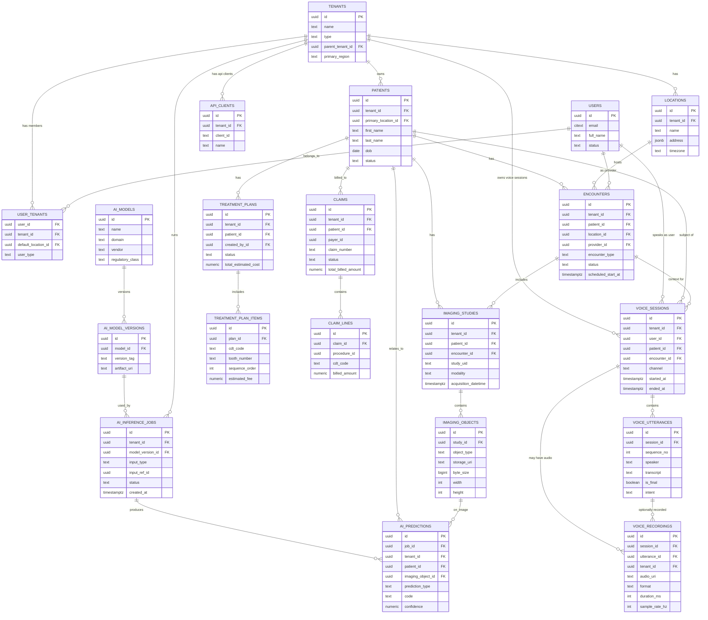

## Dental AI SaaS Data Schema – Logical Design

This document defines the logical data model for a multi‑tenant, AI‑enabled dental SaaS platform based on the `docs/market/analysis.md` findings. It is optimized for **PostgreSQL** (primary relational store) with **object storage** for large binaries (DICOM, images, 3D models) and is designed for hybrid multi‑tenancy (row‑level with optional DB/schema isolation for large tenants).

At a high level:
- **Clinical & operational data** live in a normalized relational schema (3NF with targeted denormalization for read performance).
- **Blobs** (DICOM, JPG/PNG, STL, PDFs, videos) live in object storage referenced by keys.
- **Analytics & BI** use a separate warehouse (star schema) populated via ETL/ELT from the transactional DB.

---

## I. Multi‑Tenancy & Tenant Management

### 1. Tenants & Hierarchy

- `tenants`
  - Represents an organization: solo practice, group, DSO, academic institution, payer, regulator, or AI vendor.
  - Key fields:
    - `id` (UUID, PK)
    - `name`
    - `type` (enum: SOLO_PRACTICE, GROUP_PRACTICE, DSO, ACADEMIC, PAYER, REGULATOR, AI_VENDOR, OTHER)
    - `parent_tenant_id` (FK → `tenants.id`, nullable; supports DSO hierarchies)
    - `primary_region` (for data residency/sharding)
    - `partition_strategy` (enum: ROW_LEVEL, SCHEMA, DATABASE; used by provisioning layer)
    - `status` (ACTIVE, SUSPENDED, CLOSED)

- `tenant_settings`
  - Per‑tenant configuration and preferences.
  - Includes flags for **data residency**, **default retention policies**, localization, and clinical workflow options.

- `tenant_branding`
  - White‑label configuration: logos, color schemes, email templates, etc.

- `subscription_plans`
  - Catalog of commercially available plans (e.g., BASIC, PRO, ENTERPRISE, RESEARCH).

- `tenant_subscriptions`
  - Actual subscription instances per tenant:
    - `tenant_id`, `plan_id`, `start_at`, `end_at`, `status`
    - Billing cycle, trial flags, auto‑renew settings.

- `tenant_features`
  - Many‑to‑many table assigning concrete capabilities/feature flags to a tenant (e.g., `AI_DIAGNOSTICS`, `ORTHO_PLANNING`, `IMPLANT_PLANNING`, `FEDERATED_LEARNING`).

- `tenant_quotas`
  - Limits by tenant:
    - `max_users`, `max_storage_bytes`, `max_ai_inferences_per_month`, `api_rate_limit_per_minute`, etc.

### 2. Locations & Organizational Units

- `locations`
  - Physical or virtual sites (clinics, teaching clinics, research units).
  - Linked to a `tenant_id`; DSOs will have many locations under one tenant.

- `teams`
  - Logical groupings inside a tenant (e.g., Hygiene team, Perio department, Research group).

- `team_members`
  - Associates users with teams and optional location scopes.

---

## II. Identity, Access Management & Audit

### 1. Users, Roles & Permissions

- `users`
  - Global user identity (may belong to multiple tenants).
  - Core attributes:
    - `id` (UUID, PK)
    - `email` (unique)
    - `full_name`
    - `preferred_locale`
    - `status` (ACTIVE, INVITED, DISABLED)

- `user_auth_identities`
  - Authentication methods:
    - Password auth (bcrypt/scrypt hash), SSO (OIDC/SAML), OAuth providers.
    - MFA secrets (TOTP), recovery options.

- `user_tenants`
  - Many‑to‑many association:
    - `user_id`, `tenant_id`
    - `default_location_id` (nullable)
    - `user_type` (DENTIST, HYGIENIST, ASSISTANT, ADMIN, FRONT_DESK, PATIENT, PAYER_ANALYST, REGULATOR, DEVELOPER)

- `roles`
  - Role templates; may be global or tenant‑scoped.
  - Examples: `TENANT_ADMIN`, `CLINICIAN`, `READ_ONLY_AUDITOR`, `DATA_SCIENTIST`.

- `permissions`
  - Atomic capabilities: `view_patient`, `edit_patient`, `view_imaging`, `run_ai_analysis`, `manage_billing`, etc.

- `role_permissions`
  - Many‑to‑many: `role_id` ↔ `permission_id`.

- `user_roles`
  - Assigns roles to users, scoped by tenant and optionally location/team.
  - Additional attributes to support ABAC:
    - `resource_scope` (e.g., ALL_LOCATIONS, LOCATION, TEAM, SELF)
    - `valid_from`, `valid_until` for time‑bounded access.

### 2. Sessions & API Access

- `sessions`
  - Active application sessions; stores device info, IP, user agent, last activity.

- `api_clients`
  - **Machine‑to‑machine service accounts** (including AI agents and external integrations).
  - Key fields:
    - `id` (UUID, PK)
    - `tenant_id` (FK → `tenants.id`, nullable for global clients; set for tenant‑scoped agents)
    - `client_id` (public identifier used in OAuth/client‑credentials or similar flows; unique)
    - `name` (human‑readable label, e.g., “AI Voice Agent – US East”)
    - `description` (optional)
    - `client_secret_hash` (hashed secret, never store plain text)
    - `scopes` (JSONB array/list of allowed permission scopes, e.g., `["patient.read", "note.write"]`)
    - `rate_limit_per_minute` (optional throttle per client)
    - `ip_allowlist` (JSONB of allowed IP ranges, optional)
    - `created_at`, `updated_at`
  - Usage:
    - Used together with `audit_events.actor_type = API_CLIENT` and `actor_id = api_clients.id` to track automated actions (e.g., AI agent updates triggered from `voice_utterances` or other automated workflows).

### 3. Audit & Compliance

- `audit_events`
  - Immutable append‑only log of security‑relevant actions:
    - `id`, `tenant_id`, `user_id` (nullable for system), `actor_type` (USER, SYSTEM, API_CLIENT)
    - `event_type` (e.g., PATIENT_VIEWED, IMAGE_ANALYZED, AI_OVERRIDE, LOGIN_SUCCESS, LOGIN_FAILED, CONFIG_CHANGED)
    - `resource_type` + `resource_id` (e.g., PATIENT/UUID, IMAGE_STUDY/UUID)
    - `timestamp`, `request_id`, `ip_address`, `user_agent`
    - `metadata` (JSONB; fine‑grained details without exposing PHI in logs where not necessary).

- `phi_access_logs`
  - Optional specialized table for **PHI access**, if stricter HIPAA/GDPR tracking is needed.

- `consents`
  - Captures patient/subject consent:
    - `subject_type` (PATIENT, PROVIDER, TENANT)
    - `subject_id`
    - `tenant_id`
    - `consent_type` (AI_ANALYSIS, RESEARCH, DATA_SHARING, MARKETING)
    - `scope` (which entities are covered; JSONB)
    - `granted_at`, `revoked_at`, `source` (portal, in‑clinic, paper scan)
    - `document_uri` (PDF or image in object storage).

- `data_retention_policies`
  - Per‑tenant and per‑data‑class retention:
    - `tenant_id`, `data_class` (PATIENT_RECORD, IMAGING, LOGS, ANALYTICS), `min_years`, `max_years`, `archival_strategy`.

- `legal_holds`
  - Records of entities under legal hold; overrides retention deletion until released.

---

## III. Patient & Clinical Data

### 1. Patient Master Data

- `patients`
  - Tenant‑scoped patient master record:
    - `id` (UUID)
    - `tenant_id` (FK, part of partitioning strategy)
    - `primary_location_id` (nullable)
    - `first_name`, `last_name`, `dob`, `sex_at_birth`, `gender_identity` (optional)
    - `contact_email`, `phone_mobile`, `phone_home`
    - `preferred_language`, `preferred_contact_method`
    - `status` (ACTIVE, INACTIVE, DECEASED)

- `patient_identifiers`
  - Allows multiple identifiers:
    - `patient_id`, `system` (INTERNAL, MRN, INSURANCE_MEMBER, NATIONAL_ID, DSO_GLOBAL_ID), `value`, `is_primary`.

- `patient_addresses`
  - Physical and mailing addresses.

- `patient_insurance_policies`
  - `patient_id`, `payer_id`, `plan_name`, `policy_number`, `group_number`, coverage dates, primary/secondary flag.

- `patient_relationships`
  - Family and guardian relationships:
    - `patient_id`, `related_patient_id` or `external_contact_id`, `relationship_type` (SPOUSE, CHILD, GUARDIAN, EMERGENCY_CONTACT).

### 2. History & Problem Lists

- `patient_conditions`
  - Active and historical diagnoses (ICD‑10, SNOMED, custom codes).

- `patient_medications`
  - Current and historical medications, dosages, start/stop dates, prescriber.

- `patient_allergies`
  - Allergies and adverse reactions (drug, material, other).

- `patient_social_history`
  - Smoking, alcohol, relevant habits.

### 3. Encounters & Notes

- `encounters`
  - Clinical visits:
    - `id`, `tenant_id`, `patient_id`, `location_id`, `provider_id`
    - `scheduled_start_at`, `check_in_at`, `check_out_at`
    - `encounter_type` (EXAM, EMERGENCY, HYGIENE, ORTHO, IMPLANT, TEACHING)
    - `status` (SCHEDULED, IN_PROGRESS, COMPLETED, CANCELLED, NO_SHOW).

- `encounter_diagnoses`
  - Link ICD‑10/CDT/SNOMED codes to encounter.

- `clinical_notes`
  - SOAP or free‑text notes per encounter:
    - `id`, `encounter_id`, `author_id`, `note_type` (SOAP, RADIOLOGY_REPORT, OP_NOTE), `content` (text/Markdown), `signed_at`, `amended_at`, with amendment audit trail.

- `vital_signs`
  - Time‑stamped vitals (BP, HR, BMI, etc.) per encounter.

### 4. Dental Charting & Perio

- `tooth_chart_snapshots`
  - Snapshot of full dental chart for a patient at a point in time:
    - `id`, `tenant_id`, `patient_id`, `encounter_id` (nullable for non‑visit chart), `created_at`, `chart_json` (JSONB).
  - `chart_json` captures:
    - Tooth numbering (supporting multiple systems via code system metadata).
    - Per‑tooth/per‑surface conditions, restorations, prostheses, and statuses.

- `perio_measurements`
  - Row‑level representation for analytics:
    - `id`, `tenant_id`, `patient_id`, `encounter_id`, `tooth_number`, `site` (M/B/D/L etc.), `pocket_depth_mm`, `gingival_margin_mm`, `bleeding_on_probing` (bool), `mobility_grade`, `furcation_involvement`.

### 5. Treatment Plans, Procedures & Outcomes

- `treatment_plans`
  - High‑level plans:
    - `id`, `tenant_id`, `patient_id`, `created_by_id`, `status` (DRAFT, PRESENTED, ACCEPTED, DECLINED, PARTIALLY_ACCEPTED, COMPLETED), `total_estimated_cost`, `estimated_insurance_coverage`, `notes`.

- `treatment_plan_items`
  - Planned procedures:
    - `plan_id`, `cdt_code`, `tooth_number` (nullable), `surface`, `phase`, `sequence_order`, `estimated_fee`, `estimated_patient_portion`.

- `procedures`
  - Completed clinical services:
    - `id`, `tenant_id`, `patient_id`, `encounter_id`, `provider_id`, `cdt_code`, `tooth_number`, `surface`, `start_at`, `end_at`, `status`, `notes`.

- `procedure_materials`
  - Materials used (linked to `material_reference`).

- `clinical_outcomes`
  - Follow‑up results for outcome tracking:
    - `procedure_id` or `encounter_id`, outcome scores, complications, success/failure flags.

---

## IV. Imaging & AI Analysis

### 1. Imaging Studies & Files

- `imaging_studies`
  - Abstracts DICOM Study/Series concepts:
    - `id`, `tenant_id`, `patient_id`, `encounter_id` (nullable), `study_uid` (DICOM), `modality` (INTRAORAL, PANORAMIC, CBCT, PHOTO, VIDEO), `body_part`, `acquisition_datetime`, `referring_provider_id`, `performing_device_id`, `source_system` (PMS/EHR/PACS identifier).

- `imaging_series`
  - Optional; groups related images within a study.

- `imaging_objects`
  - Individual image/volume files:
    - `id`, `study_id`, `series_id` (nullable), `sop_instance_uid` (if DICOM), `object_type` (DICOM, JPEG, PNG, STL, MP4), `storage_uri` (object storage key), `hash`, `byte_size`, `width`, `height`, `depth_slices` (for CBCT), `is_original`, `processing_pipeline` (JSONB).

- `image_annotations`
  - Structured annotations and markups:
    - `id`, `tenant_id`, `imaging_object_id`
    - `source_type` (AI, USER)
    - `author_user_id` (nullable for AI)
    - `annotation_type` (BOUNDING_BOX, MASK, MEASUREMENT, LABEL)
    - `geometry` (JSONB: coordinates, polygons)
    - `label_code` (condition code; maps to reference table)
    - `confidence` (for AI)
    - `version`, `created_at`.

### 2. AI Models & Deployment

- `ai_models`
  - Logical model families:
    - `id`, `name`, `description`, `domain` (CARIES, PERIO, PATHOLOGY, ORTHO, IMPLANT, CDS), `vendor` (INTERNAL, EXTERNAL_TAG), `regulatory_class` (FDA_510K, CE_MDR, EXPERIMENTAL).

- `ai_model_versions`
  - Concrete versions:
    - `id`, `model_id`, `version_tag` (e.g., 1.3.0), `artifact_uri`, `input_types` (list), `output_types`, `performance_metrics` (JSONB: sensitivity, specificity, AUC), `validated_on` (timestamp), `validation_summary_uri`, `sbom_uri`.

- `ai_model_deployments`
  - What version is active where:
    - `id`, `tenant_id` (nullable for global), `model_version_id`, `status` (ROLLED_OUT, CANARY, DISABLED), `rollout_strategy` (PERCENTAGE, TENANT_GROUP, LOCATION_GROUP), `created_at`, `created_by_id`.

### 3. Inference Jobs & Predictions

- `ai_inference_jobs`
  - Represents one AI run:
    - `id`, `tenant_id`, `model_version_id`
    - `input_type` (IMAGING_STUDY, PATIENT_SNAPSHOT, TEXT_NOTE, MULTIMODAL)
    - `input_ref_id` (e.g., `imaging_study.id`)
    - `status` (QUEUED, RUNNING, SUCCEEDED, FAILED)
    - `requested_by_user_id`
    - `started_at`, `completed_at`
    - `compute_env` (CLOUD_REGION, GPU_TYPE)
    - `error_details` (nullable).

- `ai_predictions`
  - Atomic predicted findings:
    - `id`, `job_id`, `tenant_id`, `patient_id`, `imaging_object_id` (nullable), `prediction_type` (CARIES, BONE_LOSS, PATHOLOGY, RISK_SCORE, TREATMENT_RECOMMENDATION), `code` (maps to clinical concept), `confidence`, `severity`, `roi_ref` (FK → `image_annotations.id`, nullable), `raw_output` (JSONB).

- `ai_review_events`
  - Human review and overrides:
    - `id`, `prediction_id`, `reviewer_id`, `review_action` (CONFIRMED, REJECTED, EDITED), `reason_code`, `comment`, `created_at`, `use_for_training` (bool).

- `ai_outcome_links`
  - Connect predictions to eventual ground truth (for accuracy monitoring):
    - `prediction_id`, `encounter_id` or `procedure_id`, `ground_truth_code`, `ground_truth_source` (PATHOLOGY_REPORT, FOLLOWUP_IMAGING, CLINICAL_NOTE), `evaluation_timestamp`.

---

## V. Integrations & Interoperability

### 1. External Systems & Connections

- `external_systems`
  - Catalog of system types: PMS, EHR, PACS, LIMS, PAYMENT_GATEWAY, INSURANCE_CLEARINGHOUSE.

- `tenant_integrations`
  - Active integrations per tenant:
    - `tenant_id`, `external_system_id`, `system_type`, `display_name`, `status`, `sync_mode` (UNIDIRECTIONAL, BIDIRECTIONAL).

- `integration_credentials`
  - Encrypted storage of API keys, OAuth tokens, endpoints; KMS‑managed field‑level encryption.

- `sync_jobs`
  - High‑level sync operations (e.g., schedule import, claim export).

- `sync_job_logs`
  - Per‑record sync status, error messages, counts of created/updated/failed.

### 2. Standard Messaging

- `fhir_resources`
  - Optional cache of FHIR resources for interoperability (e.g., `Patient`, `Observation`, `Procedure`); primarily for API responses and transformations.

- `dicom_transactions`
  - Records of DICOM C‑STORE/C‑FIND/C‑MOVE interactions with external PACS.

- `webhook_subscriptions` / `webhook_events` / `webhook_deliveries`
  - Event‑driven integration with third‑party systems.

---

## VI. Billing, Subscription & Clinical Finance

### 1. Platform Billing (SaaS)

- `billing_plans` (alias `subscription_plans`)
  - Plan details: price per month/year, included AI calls, seats, storage.

- `tenant_billing_accounts`
  - Billing profile per tenant: invoicing contact, billing address, payment method token.

- `invoices`
  - Platform invoices to tenants:
    - `id`, `tenant_id`, `period_start`, `period_end`, `status`, `currency`, `total_amount`, `due_date`, `paid_at`.

- `invoice_line_items`
  - Items like subscription fees, AI overages, storage overages, support.

- `usage_meters`
  - Meter definitions: AI_INFERENCES, STORAGE_GB, ACTIVE_USERS, API_CALLS.

- `usage_meter_readings`
  - Periodic aggregates per tenant.

### 2. Clinical Billing Integration

- `procedure_catalog`
  - CDT + tenant‑custom codes and descriptions.

- `fee_schedules`
  - Fee tables per tenant, per location, or per payer.

- `claims`
  - Insurance claim header: `id`, `tenant_id`, `patient_id`, `payer_id`, `claim_number`, `status`, submission dates, total billed/allowed/paid amounts.

- `claim_lines`
  - Individual services linked to `procedures` and `treatment_plan_items`.

- `claim_status_events`
  - Tracks payer adjudication events for revenue cycle analytics.

---

## VII. Analytics & Reporting Layer (Logical)

Transactional tables above feed a separate analytics warehouse with:

- **Fact tables**
  - `fact_encounters`, `fact_procedures`, `fact_ai_inferences`, `fact_claims`, `fact_appointments`, `fact_patient_cohorts`.

- **Dimension tables**
  - `dim_time`, `dim_tenant`, `dim_location`, `dim_provider`, `dim_patient_segment`, `dim_condition`, `dim_procedure`, `dim_payer`.

This layer is implemented via ETL/ELT (e.g., dbt + columnar warehouse), not as part of the primary OLTP schema.

---

## VIII. Knowledge, Content & Communication

### 1. Knowledge Base & Protocols

- `knowledge_documents`
  - Clinical protocols, evidence summaries, and patient education content.

- `knowledge_versions`
  - Version history, authorship, review and approval metadata.

- `knowledge_localizations`
  - Language‑specific variants and regionalization.

### 2. Communication & Collaboration

- `conversations`
  - Threads for patient messaging, team chat, and case discussions.

- `conversation_participants`
  - Links users/patients to conversations with roles (AUTHOR, PARTICIPANT, OBSERVER).

- `messages`
  - Individual messages:
    - `id`, `conversation_id`, `sender_type` (USER, SYSTEM, PATIENT), `content_type` (TEXT, RICH_TEXT, FILE), `content`, `sent_at`, `delivery_state`.

- `notifications`
  - Normalized notification events (in‑app, email, SMS).

- `documents`
  - Consent forms, PDFs, reports, images:
    - `id`, `tenant_id`, `owner_type` (PATIENT, ENCOUNTER, CLAIM, TENANT), `owner_id`, `document_type`, `storage_uri`, `hash`, `signed_at`, `signer_id`.

- `referrals`
  - Cross‑provider or cross‑tenant case referrals and second‑opinion requests.

---

## IX. Governance, Reference & Extensibility

### 1. Reference & Code Systems

- `code_systems`
  - Defines coding systems (ICD‑10, SNOMED, CDT, DICOM, internal codes).

- `code_values`
  - Individual codes and descriptions; used for diagnoses, procedures, findings.

- `drug_reference`, `material_reference`, `equipment_reference`
  - Structured master data for drugs, dental materials, and devices.

### 2. Custom Fields & Workflow

- `custom_field_definitions`
  - Tenant‑specific field definitions:
    - `tenant_id`, `entity_type` (PATIENT, ENCOUNTER, PROCEDURE, etc.), `field_key`, `label`, `data_type`, `validation_rules`, `is_indexed`.

- `custom_field_values`
  - Stores actual values as **entity‑attribute‑value (EAV)**:
    - `tenant_id`, `entity_type`, `entity_id`, `field_key`, `value_text`, `value_number`, `value_json`.

- `workflows`
  - Configurable workflows (e.g., AI‑assisted review, claim appeals).

- `workflow_instances`, `workflow_transitions`
  - State machine implementation for individual cases, with auditability.

---

## X. Multi‑Tenancy, Sharding & Indexing Strategy (Summary)

- **Row‑level isolation**
  - All multi‑tenant tables include `tenant_id` and are indexed (often as first column in composite PKs).
  - Horizontal partitioning/sharding can use `tenant_id` hash or region buckets.

- **Hybrid isolation**
  - Large DSOs can be migrated to dedicated DBs or schemas using the same logical model.
  - `tenants.partition_strategy` guides provisioning and routing logic in the application layer.

- **Indexing**
  - Every FK field has an index (`tenant_id`, `patient_id`, `encounter_id`, `imaging_study_id`, etc.).
  - Composite indexes for common query patterns, e.g.:
    - `patients (tenant_id, last_name, dob)`
    - `encounters (tenant_id, patient_id, scheduled_start_at)`
    - `ai_inference_jobs (tenant_id, model_version_id, status, created_at)`
  - Full‑text indexes (PostgreSQL `GIN` on `clinical_notes.content`, `messages.content`).

---

## XI. Security, Privacy & Compliance Hooks

- All PHI‑bearing tables include:
  - `tenant_id` (for access scoping),
  - `created_at`, `created_by`, `updated_at`, `updated_by` (for provenance),
  - Optional `phi_sensitivity_level` in metadata dictionaries (not per row but per table/column).

- **Encryption**
  - Column‑level encryption for especially sensitive fields (e.g., SSN, national IDs, payment tokens).
  - Keys managed via cloud KMS and rotated regularly.

- **De‑identification & research use**
  - De‑identified datasets for AI training reference:
    - `research_datasets`, `research_dataset_members`, `research_access_logs`.
  - Link to consents and de‑identification methods (safe harbor vs expert determination).

---

## XII. Relationship Overview (High‑Level ERD Narrative)

- `tenants` 1‑to‑many `locations`, `users` (via `user_tenants`), `patients`, `encounters`, `imaging_studies`, `ai_inference_jobs`, `voice_sessions`, `invoices`.
- `patients` 1‑to‑many `encounters`, `imaging_studies`, `treatment_plans`, `procedures`, `claims`, `perio_measurements`, `voice_sessions`.
- `encounters` 1‑to‑many `clinical_notes`, `encounter_diagnoses`, `procedures`, `imaging_studies` (optional), `voice_sessions` (optional).
- `imaging_studies` 1‑to‑many `imaging_objects`, which 1‑to‑many `image_annotations`.
- `ai_models` 1‑to‑many `ai_model_versions` 1‑to‑many `ai_inference_jobs` 1‑to‑many `ai_predictions` 1‑to‑many `ai_review_events`.
- `treatment_plans` 1‑to‑many `treatment_plan_items` and many‑to‑many with `procedures` via links.
- `claims` 1‑to‑many `claim_lines`, each referencing `procedures` or `treatment_plan_items`.
- `voice_sessions` 1‑to‑many `voice_utterances` and 1‑to‑many `voice_recordings`; `voice_utterances` can be linked to downstream actions (notes, appointments, AI jobs) via foreign keys or audit metadata.

For detailed table/field specifications, see the adjacent `schema-core.yaml`, which mirrors this logical model in a machine‑readable form suitable for code generation and DDL creation.

---

## XIII. Core ERD Diagram (with Key Attributes)

The following Mermaid ERD diagram shows the **core entities**, their **primary attributes**, and the **relationships** between them. It focuses on the most important tables for day‑to‑day workflows (multi‑tenancy, patients, encounters, imaging, AI, billing).

---

## XIV. Voice & Conversational AI Schema Extensions

To support an **AI voice agent** that listens to spoken commands, executes actions, and writes data to the database, the schema introduces **voice‑specific entities** that follow the recommended pattern:

- **Transcripts and intents in Postgres (canonical source for workflows & analytics).**
- **Optional raw audio in object storage, referenced via URIs and controlled by retention and consent.**

### 1. Voice Sessions

- `voice_sessions`
  - Represents a **single voice interaction session** (e.g., a dictation session, a patient call, or a clinician–agent conversation).
  - Key fields:
    - `id` (UUID, PK)
    - `tenant_id` (FK → `tenants.id`)
    - `user_id` (FK → `users.id`, clinician/staff if authenticated)
    - `patient_id` (FK → `patients.id`, if the session is about a specific patient)
    - `encounter_id` (FK → `encounters.id`, if tied to a visit)
    - `channel` (MOBILE_APP, BROWSER, PHONE, DEVICE)
    - `started_at`, `ended_at`
    - `meta` (JSONB; device, locale, ASR engine, etc.)

### 2. Voice Utterances (Transcripts & Intents)

- `voice_utterances`
  - Stores **per‑utterance transcripts and NLU results**, not audio:
    - `id` (UUID, PK)
    - `session_id` (FK → `voice_sessions.id`)
    - `sequence_no` (int; order within session)
    - `speaker` (USER, PATIENT, AGENT)
    - `transcript` (final text string)
    - `is_final` (bool; partial vs. final ASR result)
    - `intent` (high‑level command, e.g., `create_note`, `schedule_appointment`)
    - `entities` (JSONB; structured slots such as tooth numbers, procedure codes, dates)
    - `created_at`
  - These rows provide the **auditable record of what was said and how it was interpreted**, and can be linked to downstream actions:
    - `audit_events` (who did what, based on which utterance)
    - `clinical_notes` (voice‑authored notes)
    - `appointments`, `procedures`, `ai_inference_jobs` triggered from voice.

### 3. Optional Audio Recordings

- `voice_recordings`
  - Only used when there is a clearly justified need (QA, medico‑legal, research with consent).
  - Key fields:
    - `id` (UUID, PK)
    - `session_id` (FK → `voice_sessions.id`)
    - `utterance_id` (FK → `voice_utterances.id`, nullable if chunked differently)
    - `tenant_id` (FK → `tenants.id`)
    - `audio_uri` (object storage key: S3/Blob/GCS)
    - `format` (OPUS, WAV, MP3)
    - `duration_ms`, `sample_rate_hz`
    - `is_redacted` (bool; whether PHI has been programmatically redacted)
    - `storage_class` (HOT, ARCHIVE)
    - `retention_until` (for automatic cleanup based on `data_retention_policies`)
    - `created_at`
  - **No audio bytes are stored directly in Postgres**; the DB only holds metadata and secure URIs.

### 4. How This Aligns With the Practical Recommendation

- By default, the platform:
  - **Stores transcripts, intents, and entities in `voice_utterances`**, which are fully linked to clinical and operational entities and audited via `audit_events`.
  - Uses `voice_sessions` as the top‑level context for **who spoke, about which patient/encounter, and when**.
  - Treats `voice_recordings` as **optional**, governed by:
    - `consents` (e.g., RESEARCH, QA/recording consent),
    - `data_retention_policies` (shorter retention for audio vs. core clinical record),
    - Access logging via `audit_events` whenever audio is played back or exported.
- This ensures the AI agent can **reliably perform and audit actions from voice** while minimizing PHI risk from long‑term audio storage.

