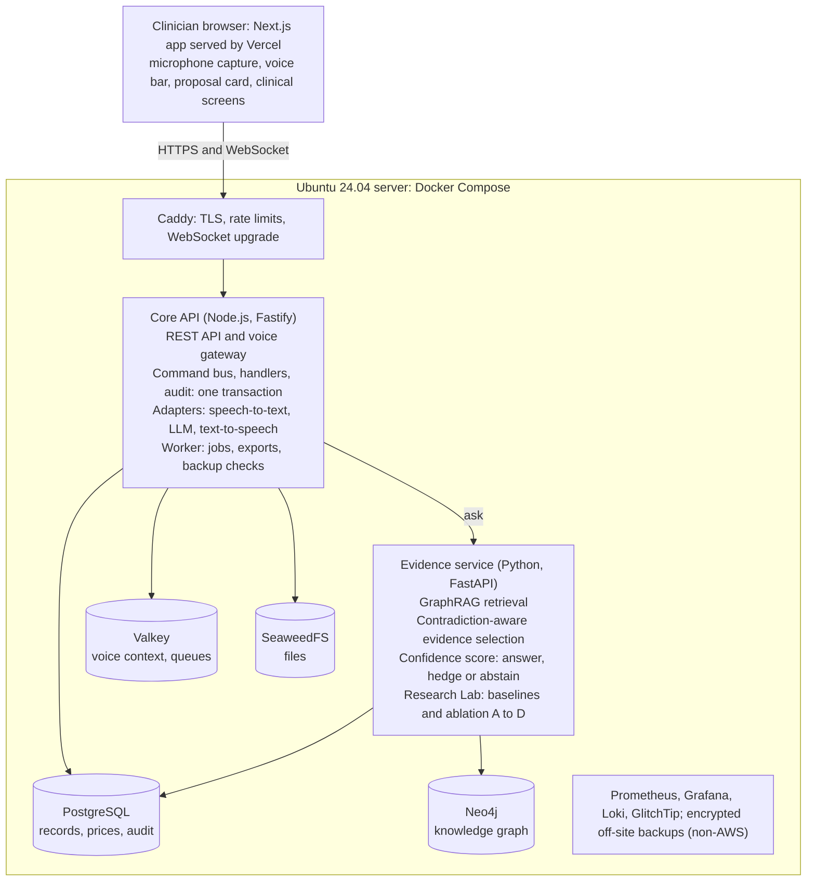
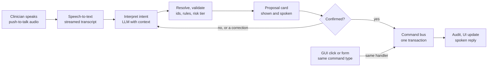

# Voice-First Dental AI Platform — Production Specification & Implementation Plan

Oct 1, 2026 · @Reza

## Summary

The thesis proposal and the product brief describe two different things, and the design below keeps both intact by layering them. The proposal (_A Retrieval-Augmented Generation Architecture for Reducing Hallucinations of Large Language Models in Dental Question Answering_) specifies a GraphRAG question-answering system with two novel mechanisms and a controlled evaluation. It does not specify a clinical workflow, voice interaction, or cost tracking. Those come from the brief and, partly, from the `dental-saas` repository.

The application is therefore three layers on one platform:

1. **Clinical platform** — patients, history, examination, diagnosis, treatment planning, procedures, material usage, costs, session summary. Source: brief and repository.
2. **Voice command layer** — one interaction layer that turns speech into validated commands. It calls the same command handlers as the GUI and never touches the database. Source: brief; the repository has schema and UX notes only.
3. **Evidence Assistant and Research Lab** — the thesis system: dental knowledge graph, contradiction-aware evidence selection, confidence-aware answering with abstention, four-way baseline comparison and ablation. Source: proposal, unchanged.

The layers meet at two points. A clinician asks a clinical question by voice and the Evidence Assistant answers with sources and a confidence tier. De-identified clinical records feed the knowledge graph, as the proposal's data section describes.

### Decisions

| Area             | Decision                                                                                                                                                        | Main alternative rejected                                                                  |
| ---------------- | --------------------------------------------------------------------------------------------------------------------------------------------------------------- | ------------------------------------------------------------------------------------------ |
| Backend shape    | One TypeScript modular monolith (Fastify, Drizzle, Zod) plus one Python service for the thesis pipeline                                                         | The repository's microservices and gateway: operational cost with no benefit on one server |
| Research runtime | Python (FastAPI), because the proposal names Python, a graph database and automatic evaluation libraries                                                        | Rewriting the methodology in TypeScript                                                    |
| Databases        | PostgreSQL 16 with pgvector for records and text retrieval; Neo4j Community for the knowledge graph                                                             | Graph in Postgres only: weaker multi-hop traversal, which the method depends on            |
| Hosting          | Next.js on Vercel; everything else in Docker Compose on one Ubuntu 24.04 LTS server behind Caddy                                                                | Kubernetes, Helm and Terraform from the repository                                         |
| AWS              | None. SeaweedFS on the server for objects; off-site backups to a non-AWS provider                                                                               | S3, RDS, EKS, LocalStack                                                                   |
| Voice            | Command bus with a typed command registry; LLM proposes, server validates, user confirms, handler executes                                                      | Speech handlers inside screens                                                             |
| Prices           | Append-only price versions with validity periods; every usage row snapshots the price it used                                                                   | Mutable `price` column on the material                                                     |
| Tenancy          | Keep `clinic_id` on every row with Postgres row-level security, clinic onboarding and per-clinic settings from the first release; subscription billing deferred | Full multi-tenant SaaS billing from the repository                                         |

### What you decided

English first on a schema built for many languages. External speech and LLM APIs on a CPU-only server, with self-hosted inference possible later. Several clinics from the first release. The thesis is examined on the QA system only, and its data is identity-independent. Country, regulator and currency are settings each clinic chooses; tax is not handled. Section Q records every decision and its effect.

## A. Executive Architecture

A Next.js client on Vercel talks to one API on one Ubuntu server; that API owns all clinical writes and delegates clinical questions to a separate Python evidence service. Every state change, from voice or from a click, is a typed command that passes through one command bus.



Only Caddy is reachable from the internet. The evidence service is called by the Core API and also reads knowledge tables in PostgreSQL.

| Component        | Runs on                     | Technology                                                                          | Responsibility                                                                                          |
| ---------------- | --------------------------- | ----------------------------------------------------------------------------------- | ------------------------------------------------------------------------------------------------------- |
| Web client       | Vercel                      | Next.js App Router, React, TypeScript, Tailwind, shadcn/ui, TanStack Query, Zustand | Screens, microphone capture, confirmation UI, text-to-speech playback                                   |
| Reverse proxy    | Ubuntu                      | Caddy 2                                                                             | TLS, HTTP/2, WebSocket upgrade, rate limits, security headers                                           |
| Core API         | Ubuntu                      | Node.js 22 LTS, Fastify 5, Drizzle ORM, Zod                                         | Auth, RBAC, clinical modules, catalog and pricing, command bus, audit                                   |
| Voice gateway    | Ubuntu (module of Core API) | WebSocket, speech and LLM provider adapters                                         | Audio in, transcript, intent, proposed command, confirmation state                                      |
| Worker           | Ubuntu                      | BullMQ on Redis                                                                     | Audio transcoding, document jobs, de-identified exports, graph ingestion triggers, backups verification |
| Evidence service | Ubuntu                      | Python 3.12, FastAPI                                                                | Thesis pipeline: retrieval, contradiction module, confidence module, generation, experiment runner      |
| Relational store | Ubuntu                      | PostgreSQL 16 with pgvector                                                         | Clinical records, catalog, prices, audit, voice logs, text chunks and embeddings, experiment results    |
| Graph store      | Ubuntu                      | Neo4j 5 Community                                                                   | Dental knowledge graph: entities, relations, evidence and source links                                  |
| Cache and queue  | Ubuntu                      | Valkey 8 (Redis-compatible, BSD)                                                    | Conversation state, rate limits, job queues, idempotency keys                                           |
| Object store     | Ubuntu                      | SeaweedFS (S3-compatible, Apache-2.0)                                               | Documents, radiographs, voice recordings, exports; server-side encryption                               |
| Observability    | Ubuntu                      | Prometheus, Grafana, Loki, GlitchTip                                                | Metrics, logs, error tracking, alerts                                                                   |

Valkey and SeaweedFS replace Redis and MinIO from the first draft so that every installed component is open source. Where later sections say Redis or MinIO, read the role: cache and queue, and object store. The full package list and build plan are in Implementation Plan.

### Why this shape

- **Modular monolith, not microservices.** The repository splits auth, users and clinical into services behind a gateway. On one server that adds network hops, three deployables and cross-service transactions. Material usage, price lookup and audit must commit in one database transaction; a monolith makes that trivial. Module boundaries are kept in code so a module can be extracted later.
- **TypeScript for the core.** The repository's Drizzle schemas, Zod validators and Vitest suites are TypeScript and reusable. Types are shared with the Vercel client through one package.
- **Python for the thesis.** The proposal lists Python, retrieval pipeline libraries, a graph database and automatic evaluation libraries as research tools. Keeping the pipeline in Python means the system the committee evaluates is the system in production.
- **Two processes, one contract.** The Core API calls the evidence service over an internal HTTP interface that is not exposed to the internet. The evidence service has read access to the knowledge stores only and no write access to clinical tables.
- **Vercel serves UI only.** No patient data is stored or processed in Vercel functions. The browser calls the API origin directly, so clinical data flows browser to Ubuntu server.
- **Provider adapters for speech and LLM.** Speech-to-text, text-to-speech and LLM calls sit behind interfaces. The first release calls external APIs from a CPU-only server. Self-hosted GPU inference can be added later behind the same interfaces without touching the command layer.

## B. Requirements Analysis

Requirements carry a source tag so research requirements stay separate from product requirements: **P** = thesis proposal, **B** = your brief, **R** = repository.

### Functional requirements

| ID  | Requirement                                                                                                  | Source                       |
| --- | ------------------------------------------------------------------------------------------------------------ | ---------------------------- |
| F1  | Login, sessions, roles and permissions per clinic                                                            | B, R                         |
| F2  | Patient search, create, update, profile                                                                      | B, R                         |
| F3  | Medical and dental history: conditions, medications, allergies, risk factors                                 | B, R, P (data categories)    |
| F4  | Clinical session (encounter) with chief complaint, findings per tooth and surface, periodontal status, notes | B, R, P (data categories)    |
| F5  | Diagnosis recorded per session, per tooth where relevant                                                     | B, R, P (data categories)    |
| F6  | Treatment plan with ordered items, tooth, status                                                             | B, R                         |
| F7  | Procedures performed in a session, linked to plan items                                                      | B, R                         |
| F8  | Material usage per procedure: quantity, unit, wastage, price snapshot                                        | B (R has a stub table)       |
| F9  | Procedure-level, session-level and patient-history cost views                                                | B                            |
| F10 | Price and Material Management Panel with versioned prices, suppliers, categories, procedure templates        | B                            |
| F11 | Voice-first operation of F2–F10 with confirmation and correction                                             | B (R has UX notes)           |
| F12 | Session summary and finalisation; signed records become immutable                                            | B                            |
| F13 | Audit history for every write, voice command and price change                                                | B, R                         |
| F14 | Dental question answering with answer, supporting evidence, sources and confidence score                     | P                            |
| F15 | Contradiction-aware evidence selection before generation                                                     | P (novelty 1)                |
| F16 | Three-tier answer policy: definite, hedged, abstain                                                          | P (novelty 2)                |
| F17 | Knowledge corpus and knowledge graph with source credibility metadata and traceable triples                  | P                            |
| F18 | Experiment runner: base LLM, Text-RAG, base GraphRAG, proposed method; ablation A–D on a fixed question set  | P                            |
| F19 | Claim-level labelling and blinded expert review forms with inter-rater agreement                             | P                            |
| F20 | De-identified export of clinical records for knowledge extraction                                            | P (data and ethics sections) |

### Non-functional requirements

| ID  | Requirement                                                                                  | Target                                                              |
| --- | -------------------------------------------------------------------------------------------- | ------------------------------------------------------------------- |
| N1  | No AWS; frontend on Vercel; backend on Ubuntu                                                | Fixed by brief                                                      |
| N2  | Voice round trip, end of speech to proposed action on screen                                 | Under 2 s at the 95th percentile; assumption to validate in Phase 3 |
| N3  | GUI works fully without voice; voice failure never blocks a session                          | Every command reachable by click                                    |
| N4  | Clinical writes are transactional, idempotent and audited in the same transaction            | All command handlers                                                |
| N5  | Historical costs never change when a price changes                                           | Enforced in schema and tests                                        |
| N6  | Patient data isolation per clinic and per role                                               | Row-level security plus RBAC                                        |
| N7  | Recovery point 15 minutes or better; recovery time 4 hours or better                         | Assumption; set with the clinic                                     |
| N8  | Encryption in transit and at rest                                                            | TLS 1.3; encrypted volume, backups and objects                      |
| N9  | Research runs are reproducible: frozen dataset, model, settings and pipeline version per run | Proposal's control variables                                        |
| N10 | Tablet and desktop layouts usable at arm's length during treatment                           | Section K                                                           |

### Proposal versus repository

| Requirement                               | Proposal                                                 | Repository                                                                               | Final decision                                                                               | Implementation                     |
| ----------------------------------------- | -------------------------------------------------------- | ---------------------------------------------------------------------------------------- | -------------------------------------------------------------------------------------------- | ---------------------------------- |
| GraphRAG QA with two control mechanisms   | Core contribution                                        | Absent; only `knowledge_documents` tables and an agent design note                       | Proposal governs                                                                             | Python evidence service, section C |
| Knowledge graph store                     | Graph database required                                  | pgvector image only                                                                      | Add Neo4j                                                                                    | Section E                          |
| Baselines and ablation                    | Required                                                 | Absent                                                                                   | Build as first-class module                                                                  | Research Lab                       |
| Expert review                             | Required                                                 | `ai_review_events` table, no code                                                        | Build; reuse the idea                                                                        | Review UI and tables               |
| Patient records                           | Used as de-identified data source                        | Patients, encounters, notes, chart entries, treatment plans with routes and tests        | Keep the domain model, rebuild in the monolith                                               | Section F                          |
| Voice                                     | Not mentioned                                            | Three tables, stub WebSocket that closes, placeholder component, a confirmation UX guide | Brief governs; build the layer new                                                           | Section H                          |
| Materials and prices                      | "Materials or method used" is a data field               | `procedure_materials` with a free-text code, no catalog, no price                        | Brief governs; new model                                                                     | Section J                          |
| Multi-tenancy                             | Not mentioned                                            | Tenants, locations, subscriptions, quotas                                                | Multi-clinic SaaS confirmed: keep tenancy, add clinic onboarding, defer subscription billing | Section F                          |
| Insurance claims, FHIR, DICOM, imaging AI | Out of scope; proposal calls image analysis beyond scope | Schema only                                                                              | Defer; not built                                                                             | Out of scope list in Q             |
| Deployment                                | Not specified                                            | AWS Terraform, LocalStack, Kubernetes, Helm                                              | Brief governs; remove                                                                        | Section M                          |
| AI as decision support only               | Stated in ethics section                                 | Human-in-the-loop tables                                                                 | Consistent; enforce in UI                                                                    | Sections H, K                      |

**One conflict to note.** The proposal's hypothesis 3 compares against base GraphRAG, Text-RAG and a plain LLM under identical settings. The production assistant must therefore run the frozen proposed pipeline, not a tuned variant, or the thesis results will not describe the deployed system. Pipeline versions are pinned per release.

## C. Proposal ↔ Software Mapping

Every research element in the proposal has a named software component, and none is simplified. The proposal's own statement of scope holds: the novelty is the two mechanisms, not GraphRAG, the graph, or hallucination reduction as a goal.

### Research definition extracted from the proposal

| Item                     | Content                                                                                                                                                                                                                                                                                                                                                     |
| ------------------------ | ----------------------------------------------------------------------------------------------------------------------------------------------------------------------------------------------------------------------------------------------------------------------------------------------------------------------------------------------------------- |
| General objective        | Design and evaluate a RAG-based dental QA architecture that manages contradictory evidence and controls answer certainty, reducing hallucination rate against baseline architectures                                                                                                                                                                        |
| Research questions       | 1. Does the contradiction-aware mechanism reduce contradictory evidence in the generation context? 2. Does the confidence mechanism prevent definite answers under insufficient or conflicting evidence? 3. Does the proposed GraphRAG reduce hallucination and increase reliability against base GraphRAG?                                                 |
| Hypotheses               | H1: lower contradiction rate than baseline. H2: higher correct abstention rate and lower calibration error. H3: lower hallucination rate and higher faithfulness than plain LLM, Text-RAG and base GraphRAG                                                                                                                                                 |
| Method                   | 11-step algorithm: question analysis, subgraph retrieval, evidence extraction, contradiction detection, evidence scoring, selection and context building, confidence scoring, policy choice, grounded generation, output with evidence, sources and confidence                                                                                              |
| Novelty 1                | Pairwise consistency matrix (consistent, contradictory, unknown), then evidence score = α·relevance + β·consistency + γ·source credibility − δ·contradiction. Coefficients tuned on a validation set and frozen for the test set                                                                                                                            |
| Novelty 2                | Confidence = w1·coverage + w2·relevance + w3·consistency + w4·source credibility, in the range 0 to 1, mapped by two thresholds to three tiers. Thresholds set on the validation set                                                                                                                                                                        |
| Coupling                 | The contradiction output is an input to confidence, so unresolved conflict lowers certainty                                                                                                                                                                                                                                                                 |
| Knowledge representation | Triples (source entity, relation, target entity) with supporting text chunk and source id. Entities: disease, symptom, risk factor, diagnostic method, treatment, drug, complication, contraindication, referral. Relations such as causes, associated\_with, diagnosed\_by, treated\_by, contraindicated\_in, requires\_referral                           |
| Data                     | Literature corpus (indexed papers, ADA and WHO guidelines, reference textbooks, teaching material) with credibility metadata; de-identified patient records (demographic bands, clinical and diagnostic data, treatment data, free-text notes); evaluation question set including contradictory-evidence and insufficient-evidence items; expert judgements |
| Inputs and outputs       | Input: one specialised dental question. Output: answer, supporting evidence, sources, confidence score                                                                                                                                                                                                                                                      |
| Independent variables    | Contradiction module on or off; confidence module on or off; retrieval method                                                                                                                                                                                                                                                                               |
| Dependent variables      | Hallucination rate, faithfulness, answer accuracy, contradiction rate, calibration error (ECE), correct abstention rate                                                                                                                                                                                                                                     |
| Control variables        | Question domain, dataset, language model, generation settings                                                                                                                                                                                                                                                                                               |
| Baselines                | Plain LLM; Text-RAG; base GraphRAG; proposed method                                                                                                                                                                                                                                                                                                         |
| Ablation                 | A: neither module. B: contradiction only. C: confidence only. D: both                                                                                                                                                                                                                                                                                       |
| Analysis                 | Mean comparison, statistical tests where sample size allows, confidence intervals, effect sizes, inter-rater agreement. Unit of analysis is the atomic claim                                                                                                                                                                                                |
| Ethics constraints       | No real patient data without approval and full de-identification; system is informational and decision-support, never a replacement for the dentist                                                                                                                                                                                                         |

### Mapping to software

| Thesis requirement                       | Software requirement                                                                                                                                   | Module                              | Data                                                     | API                                   | UI or voice                                                     | Metric                                     |
| ---------------------------------------- | ------------------------------------------------------------------------------------------------------------------------------------------------------ | ----------------------------------- | -------------------------------------------------------- | ------------------------------------- | --------------------------------------------------------------- | ------------------------------------------ |
| Corpus with credibility metadata         | Ingest documents with title, author, year, type, credibility level, inclusion checklist                                                                | `evidence.ingest`                   | `kb_sources`, `kb_chunks`                                | `POST /kb/sources`                    | Research Lab: Sources                                           | Coverage per sub-field                     |
| Knowledge graph of traceable triples     | Extract entities and relations; attach chunk and source to each edge; expert validation of schema                                                      | `evidence.graph`                    | Neo4j nodes and edges; `kb_triples` mirror               | `POST /kb/extract`, `GET /kb/triples` | Research Lab: Graph review                                      | Triple precision on a reviewed sample      |
| Question processing                      | Parse question into concepts and required relations                                                                                                    | `evidence.query`                    | `qa_queries`                                             | `POST /evidence/ask`                  | "Ask" panel; voice intent `ask_evidence`                        | —                                          |
| Subgraph retrieval                       | One-hop and multi-hop traversal from seed nodes; relevance ranking                                                                                     | `evidence.retrieve`                 | `qa_evidence`                                            | internal                              | Evidence list                                                   | Context relevance                          |
| Novelty 1: contradiction-aware selection | Pairwise consistency matrix; scoring formula; filter or down-weight                                                                                    | `evidence.contradiction`            | `qa_evidence_pairs`, `qa_evidence.score`                 | internal; flag `contradiction=on/off` | Conflicting evidence shown struck or greyed with reason         | Contradiction rate                         |
| Novelty 2: confidence-aware generation   | Confidence formula; thresholds; three-tier policy                                                                                                      | `evidence.confidence`               | `qa_answers.confidence`, `.tier`                         | internal; flag `confidence=on/off`    | Confidence badge; hedged wording; "insufficient evidence" state | ECE, correct abstention rate               |
| Grounded generation with citations       | Structured context; instruction to assert only supported claims; keep evidence ids                                                                     | `evidence.generate`                 | `qa_answers`, `qa_answer_citations`                      | `POST /evidence/ask` response         | Answer with numbered sources; spoken short form                 | Faithfulness                               |
| Operational hallucination definition     | Decompose answers into atomic claims; label each supported, unsupported or wrong                                                                       | `lab.claims`                        | `eval_claims`                                            | `POST /lab/runs/{id}/claims`          | Claim labelling screen                                          | Hallucination rate                         |
| Baseline comparison                      | Four pipelines over one fixed set with one model and one generation config                                                                             | `lab.runner`                        | `eval_runs`, `eval_run_items`                            | `POST /lab/runs`                      | Research Lab: Runs                                              | Accuracy, hallucination rate, faithfulness |
| Ablation A–D                             | Module flags per run                                                                                                                                   | `lab.runner`                        | `eval_runs.config`                                       | `POST /lab/runs`                      | Run comparison table                                            | Per-module effect                          |
| Tuning without leakage                   | Validation and test splits; coefficients and thresholds stored per pipeline version; test split locked                                                 | `lab.datasets`                      | `eval_datasets`, `eval_items.split`, `pipeline_versions` | `POST /lab/pipeline-versions`         | Version list                                                    | —                                          |
| Expert judgement                         | Structured, blinded form; overlapping assignment                                                                                                       | `lab.review`                        | `eval_reviews`                                           | `GET/POST /lab/reviews`               | Reviewer queue                                                  | Inter-rater agreement                      |
| Statistics                               | Tests, confidence intervals, effect sizes; export                                                                                                      | `lab.stats`                         | `eval_metrics`                                           | `GET /lab/runs/{id}/metrics`          | Charts and CSV export                                           | All dependent variables                    |
| De-identified patient data               | Remove direct identifiers, assign random pseudonymous ids, band ages, shift dates; the research pipeline never receives names, contacts or patient ids | `research-export` (Core API worker) | `research_exports`, `research_consents`                  | `POST /research/exports`              | Admin: Research exports                                         | Re-identification checks                   |
| Decision support only                    | Assistant answers never write clinical data; disclaimer; no auto-diagnosis                                                                             | Command registry rule               | —                                                        | —                                     | Suggested versus confirmed styling                              | —                                          |

### Guardrails that protect the methodology

- The voice-intent LLM and the evidence pipeline are separate components with separate prompts and logs. Voice accuracy is a product metric, not a thesis variable.
- A pipeline version is immutable: model id, temperature, token limit, coefficients, thresholds, graph snapshot id and corpus snapshot id. Runs and production answers both record it.
- Metric definitions are written and stored before the final test run, as the proposal requires, and the test split cannot be read by tuning jobs.

### Identity independence of the research data

Clinical data and research data are two separate stores with a one-way, de-identifying bridge between them.

- **Clinical SaaS data** holds identifiable patient information for normal clinical operation, in the `core`, `clinical`, `catalog`, `voice` and `audit` schemas.
- **Research data** lives in the `kb`, `qa` and `lab` schemas and in Neo4j. It holds literature, de-identified or synthetic clinical representations, questions, evidence and judgements. It has no column for a name, contact detail or clinical patient id.
- The evidence service connects with a database role that cannot read the clinical schemas at all.
- The export replaces every patient id with a random pseudonym whose mapping is not kept, so re-running the pipeline with different pseudonyms must give identical results. A test asserts this.
- No identifier is a feature in retrieval, scoring, confidence, generation or evaluation. Questions sent from a clinical session to the Evidence Assistant are passed as text only, without the patient.

You have decided that ethics approval is not required for this use. The proposal's ethics section still describes approval and full de-identification as a precondition for real patient data, so that wording should be aligned with your supervisors.

## D. Repository Assessment

The repository is a broad scaffold with a working clinical CRUD core and no voice, no AI, and no pricing code; about a third of it is worth carrying forward. It is one commit of 452 files: a pnpm and Turborepo monorepo with three implemented Fastify services (auth, users, clinical), a Fastify gateway, a Next.js 15 web app, and a Drizzle schema of roughly 100 tables, most with no code using them.

| Repository component                                                                                                                 | Current purpose                                                                                                     | Keep / Modify / Rewrite | Reason                                                                                                 |
| ------------------------------------------------------------------------------------------------------------------------------------ | ------------------------------------------------------------------------------------------------------------------- | ----------------------- | ------------------------------------------------------------------------------------------------------ |
| Monorepo tooling (pnpm, Turborepo, ESLint, Prettier, Husky)                                                                          | Build and lint                                                                                                      | Keep                    | Sound and standard                                                                                     |
| `packages/config/src/schema/clinical.ts`, `clinical-context.ts`                                                                      | Patients, encounters, notes, chart entries with event history, perio, conditions, medications, allergies, diagnoses | Modify                  | Good domain model; add row-level security, sign-off state, and links to the new command log            |
| `schema/billing.ts` treatment plans and items                                                                                        | Treatment planning                                                                                                  | Modify                  | Keep plans and items; drop insurance claims                                                            |
| `schema/tenancy.ts` users, roles, permissions, sessions, audit events                                                                | Identity and audit                                                                                                  | Modify                  | Keep tables; audit must gain before and after values, source and command id                            |
| `schema/voice.ts`                                                                                                                    | Voice sessions, utterances, recordings                                                                              | Modify                  | Useful base; add interpretation, proposed command and confirmation tables                              |
| `schema/procedures-ai-governance.ts` `procedure_materials`                                                                           | Free-text material code, quantity, unit                                                                             | Rewrite                 | No catalog, no price, no expected-versus-actual; cannot meet the cost requirement                      |
| `schema/reference.ts` procedure catalog, fee schedules, CDT seed                                                                     | Procedure codes and fees                                                                                            | Modify                  | Keep catalog and seed; fee schedules become versioned like material prices                             |
| `schema/agent.ts` (13 tables), `extensibility.ts`, `integrations.ts`, `imaging.ts`, `billing-operations.ts`, `tenancy-governance.ts` | Agent orchestration, custom fields, FHIR, DICOM, imaging AI, SaaS billing, quotas                                   | Drop for now            | No code uses them; outside the proposal and the brief; each adds migration and security surface        |
| `schema/knowledge-communication.ts` knowledge documents and versions                                                                 | Document store for knowledge                                                                                        | Modify                  | Becomes `kb_sources`; needs credibility metadata the proposal requires                                 |
| `schema/compliance.ts` consents, PHI access logs, retention policies                                                                 | Compliance records                                                                                                  | Keep                    | Directly useful for patient-data protection and research consent                                       |
| `services/clinical` services, routes, Zod schemas, tests                                                                             | Patient, encounter, note, chart, treatment-plan logic                                                               | Modify                  | Port service logic and tests into monolith modules; convert writes to command handlers                 |
| `services/auth`                                                                                                                      | Register, login, refresh, sessions; bcryptjs cost 12; JWT 15 minutes and 7 days                                     | Modify                  | Keep the flow; move to argon2id, rotating refresh tokens in httpOnly cookies, MFA for privileged roles |
| `services/auth/src/middleware/authorize.ts`                                                                                          | Three-line permission check                                                                                         | Rewrite                 | No resource scoping, no policy model                                                                   |
| `services/users`                                                                                                                     | Users, roles, tenants, locations                                                                                    | Modify                  | Port into an `identity` module                                                                         |
| `apps/api-gateway`                                                                                                                   | Proxy routes, CORS, rate limit, tenant resolver, stub voice WebSocket                                               | Rewrite                 | Gateway is unnecessary with one API; keep the CORS and rate-limit tests as references                  |
| `services/billing`, `files`, `notifications`; `apps/admin`, `apps/mobile`; `packages/sdk`, `ui`                                      | README stubs                                                                                                        | Drop                    | Empty                                                                                                  |
| `apps/web` shell, patient list and form, dental chart components, auth store                                                         | Next.js UI with shadcn/ui                                                                                           | Modify                  | Keep the stack and the chart components; rebuild layout around the voice bar and session context       |
| `apps/web` voice components                                                                                                          | Placeholder indicator; toast returns null                                                                           | Rewrite                 | No implementation                                                                                      |
| `docs/ux/voice-command-confirmation.md`, `undo-implementation-guide.md`                                                              | Confirmation and undo UX guidance                                                                                   | Keep as input           | Principles match the brief; feeds section H                                                            |
| `docs/architecture/agent-implementation-guide.md`, `redis-patterns.md`                                                               | Design notes                                                                                                        | Reference only          | LangGraph-style multi-agent design is heavier than the command bus needs                               |
| `infrastructure/terraform`, LocalStack, `kubernetes`, `helm`, deploy workflows                                                       | AWS VPC module, EKS/RDS/S3 placeholders, Helm blue-green deploy                                                     | Drop                    | Violates the no-AWS rule and targets Kubernetes                                                        |
| `infrastructure/docker/docker-compose.yml`                                                                                           | pgvector Postgres 16, Redis 7, MinIO, services                                                                      | Modify                  | Right building blocks; remove LocalStack, add Neo4j, Caddy, worker, evidence service                   |
| `monitoring/` Prometheus, Grafana, alerts, Fluentd                                                                                   | Observability config                                                                                                | Modify                  | Keep Prometheus and Grafana; replace Fluentd with Loki and Promtail                                    |
| Tests: Vitest unit and integration, one Playwright login spec, k6 scenarios                                                          | Test scaffolding                                                                                                    | Modify                  | Keep the frameworks and clinical tests; end-to-end coverage is close to zero                           |
| 77 shell scripts under `scripts/`                                                                                                    | Setup, Terraform, LocalStack, Redis, secrets                                                                        | Rewrite                 | Most serve the dropped infrastructure; replace with a small Makefile and deploy script                 |

### Technical debt and wrong assumptions found

- No row-level security policies exist; tenant isolation depends on every query remembering a `tenant_id` filter.
- Each service verifies the access token with one shared symmetric secret and reads only user and clinic ids; clinical routes apply no role or permission check.
- Audit rows are written after the business write, outside its transaction and inside a try/catch, so a write can succeed with no audit row.
- The schema models far more than the code implements, which hides what is actually working.
- README and summaries describe the project as production-ready; it is a scaffold with a login and tenant UI.
- Nothing in the repository implements retrieval, a knowledge graph, or evaluation. The thesis component is entirely new work.

## E. System Architecture

The Core API is organised as domain modules behind one command bus and one query layer; the evidence service is a separate pipeline with pluggable stages so each ablation is a configuration, not a code branch.

### Frontend (Vercel)

- **Framework:** Next.js App Router. Pages are client-rendered behind login; server components are used for the shell only. No patient data is fetched in Vercel functions.
- **State:** TanStack Query for server state; Zustand for session context (active patient, active session, active procedure) and voice state.
- **Voice client:** `AudioWorklet` capture at 16 kHz mono, voice-activity detection in the browser, Opus frames over one WebSocket to the API. Push-to-talk by default (foot pedal, space bar or on-screen button); hands-free mode with a wake phrase is optional per user.
- **Realtime:** the same WebSocket carries partial transcripts, proposed commands, confirmations and UI directives such as `navigate` or `highlight tooth 16`.
- **Resilience:** optimistic UI only for navigation; clinical writes wait for the server. If the socket drops, the voice bar shows offline and every action stays available by click.
- **Internationalisation:** English first. All strings live in message catalogues and layouts support right-to-left, so a new language needs no code change.

### Multilingual design

The first release is English; nothing in the schema or the voice layer assumes it.

- **Locale fields:** `clinics.default_locale`, `users.locale`, `voice_sessions.locale` and `utterances.language` record the language in use.
- **Catalog text:** material and procedure names and their spoken aliases live in translation tables keyed by locale, so one material can be named and recognised in several languages.
- **Clinical codes:** findings, diagnoses, tooth and surface values are stored as language-neutral codes and rendered per locale. Free-text notes carry a language tag.
- **Voice:** the speech adapter, interpreter prompt and number and unit parsers are selected by locale. Commands and payloads are identical in every language.
- **Tests:** the utterance corpus is organised per locale; a language ships only when its corpus passes.
- **Research:** knowledge sources carry a language field. The thesis evaluation runs in one language as a control; another language is a separate dataset and run.

### Core API modules (Ubuntu)

| Module            | Owns                                                                | Notes                                                      |
| ----------------- | ------------------------------------------------------------------- | ---------------------------------------------------------- |
| `identity`        | Users, roles, permissions, sessions, MFA                            | Issues tokens; resolves clinic context                     |
| `patients`        | Patients, identifiers, contacts, history                            | Search with trigram and phonetic matching for spoken names |
| `clinical`        | Sessions, findings, chart entries, perio, notes, diagnoses          | Sign-off locks a session                                   |
| `planning`        | Treatment plans and items                                           | Items become procedures when performed                     |
| `procedures`      | Performed procedures                                                | Seeds expected materials from the template                 |
| `catalog`         | Materials, categories, units, suppliers, procedure types, templates | Admin panel backend                                        |
| `pricing`         | Price versions, fee versions, cost calculation                      | Pure functions over snapshots                              |
| `usage`           | Actual material usage and wastage                                   | Append-only with reversal rows                             |
| `voice`           | Voice sessions, utterances, interpretations, confirmations          | No domain writes                                           |
| `commands`        | Registry, validation, risk policy, dispatch, idempotency, undo      | Single write path                                          |
| `audit`           | Audit log, access log                                               | Written in the caller's transaction                        |
| `documents`       | Files and recordings in MinIO                                       | Signed, short-lived URLs                                   |
| `evidence-client` | Calls to the evidence service                                       | Read-only; answers stored as `qa_answers`                  |
| `research-export` | De-identified exports                                               | Runs in the worker                                         |

### One write path

A GUI form posts to a REST endpoint; a voice utterance produces a proposed command. Both end in `commandBus.execute(command, actor)`. The bus checks the Zod schema, checks permission, runs domain validation, opens a transaction, runs the handler, writes the audit row and the command log row, and commits. REST handlers contain no business logic of their own.

### Database layout

- **PostgreSQL** holds everything transactional, in schemas `core`, `clinical`, `catalog`, `voice`, `audit`, `kb`, `qa`, `lab`. Row-level security keys on `clinic_id` set per connection from the verified token.
- **pgvector** stores chunk embeddings for the Text-RAG baseline and for seed-node lookup.
- **Neo4j** holds the knowledge graph. Each node and edge carries the ids of its supporting chunk and source, so answers trace back to documents. Clinical records are never stored in Neo4j in identifiable form.
- **Redis** holds conversation context with a time-to-live, so a restart loses at most an unconfirmed proposal, never a committed action.

### Evidence service (Python)

Stages follow the proposal's algorithm and are individually switchable: `analyse_question` → `retrieve` (none, text, graph) → `detect_contradictions` (on, off) → `score_and_select` → `score_confidence` (on, off) → `decide_policy` → `generate` → `package`. The four baselines and four ablation arms are six named configurations of these stages, because arm A is base GraphRAG and arm D is the proposed method. Contradiction detection combines graph structure (opposing relations on the same entity pair) with a natural-language-inference model over evidence pairs, as the proposal allows.

### AI components and where they sit

| Component                  | Purpose                                            | Location                  | Thesis variable?              |
| -------------------------- | -------------------------------------------------- | ------------------------- | ----------------------------- |
| Speech-to-text             | Transcribe clinician speech                        | Voice gateway adapter     | No                            |
| Intent and entity model    | Map transcript and context to a registered command | Voice gateway adapter     | No                            |
| Text-to-speech             | Speak confirmations                                | Browser or adapter        | No                            |
| Embedding model            | Chunk and query vectors                            | Evidence service          | Controlled                    |
| NLI or contradiction model | Pairwise consistency labels                        | Evidence service          | Part of novelty 1             |
| Generator LLM              | Grounded answers                                   | Evidence service          | Controlled, fixed across arms |
| Extraction model           | Entities and relations for graph building          | Evidence service, offline | Infrastructure only           |

## F. Database Schema

The schema has 64 tables in eight PostgreSQL schemas, against roughly 100 in the repository; each table below is justified by the brief or the proposal. Conventions: UUID v7 primary keys, `clinic_id` on every clinic-owned row with row-level security, `created_at`, `created_by`, `updated_at`, `version` for optimistic locking, soft deactivation instead of delete for reference data, and money as `numeric(18,4)` with an explicit `currency`.

### Identity (`core`)

| Entity                                     | Purpose                      | Key fields                                                                                   | Relationships                  | Lifecycle and audit                          |
| ------------------------------------------ | ---------------------------- | -------------------------------------------------------------------------------------------- | ------------------------------ | -------------------------------------------- |
| `clinics`                                  | Owning organisation          | name, country, regulatory\_profile\_id, default\_locale, currency, timezone, tooth\_notation | Parent of all clinic data      | Created by platform admin                    |
| `users`                                    | Person who signs in          | email, password\_hash, mfa\_secret, status, locale                                           | Many clinics via `memberships` | Deactivated, never deleted; logins audited   |
| `memberships`                              | User in a clinic with a role | user\_id, clinic\_id, role\_id                                                               | users, clinics, roles          | Changes audited with before and after        |
| `roles`, `permissions`, `role_permissions` | RBAC                         | key, description                                                                             | —                              | System roles seeded; custom roles per clinic |
| `auth_sessions`                            | Refresh-token families       | user\_id, token\_hash, device, expires\_at, revoked\_at                                      | users                          | Rotated on use; reuse revokes the family     |

### Patients and clinical record (`clinical`)

| Entity                                                                                   | Purpose                             | Key fields                                                                                                                      | Relationships                                       | Lifecycle and audit                                      |
| ---------------------------------------------------------------------------------------- | ----------------------------------- | ------------------------------------------------------------------------------------------------------------------------------- | --------------------------------------------------- | -------------------------------------------------------- |
| `patients`                                                                               | Identity and demographics           | names, phonetic\_key, birth\_date, sex, national\_id (encrypted), phone, status                                                 | Owned by clinic                                     | Archived, not deleted; every read logged                 |
| `patient_conditions`, `patient_medications`, `patient_allergies`, `patient_risk_factors` | Medical and dental history          | code, description, onset, status, noted\_by                                                                                     | patients                                            | Entries are ended, not overwritten                       |
| `clinical_sessions`                                                                      | One visit                           | patient\_id, provider\_id, started\_at, ended\_at, chief\_complaint, status (open, completed, signed)                           | patients; parent of findings, diagnoses, procedures | Signed sessions are immutable; changes need an amendment |
| `findings`                                                                               | Examination observations            | session\_id, tooth, surface, finding\_code, value, note                                                                         | sessions                                            | Superseded by new rows; history kept                     |
| `chart_entries`, `chart_entry_events`                                                    | Current tooth chart and its history | tooth, surface, state, source\_finding\_id                                                                                      | patients                                            | Event-sourced, as in the repository                      |
| `perio_measurements`                                                                     | Periodontal chart                   | tooth, site, pocket\_depth, bleeding                                                                                            | sessions                                            | Append-only per session                                  |
| `diagnoses`                                                                              | Assessment                          | session\_id, tooth, code, description, certainty, status (suggested, confirmed)                                                 | sessions                                            | Only a clinician can confirm                             |
| `clinical_notes`                                                                         | Free text                           | session\_id, type, body, signed\_at                                                                                             | sessions                                            | Addenda after signing                                    |
| `treatment_plans`, `treatment_plan_items`                                                | Planned care                        | patient\_id, status; procedure\_type\_id, tooth, surface, sequence, status                                                      | patients, procedure types                           | Versioned by status changes                              |
| `procedures`                                                                             | Performed treatment                 | session\_id, plan\_item\_id, procedure\_type\_id, tooth, surface, status, started\_at, ended\_at, fee\_version\_id, fee\_amount | sessions, plan items                                | Completed procedures locked with the session             |
| `session_amendments`                                                                     | Corrections after signing           | session\_id, reason, command\_id                                                                                                | sessions                                            | Always audited                                           |
| `documents`                                                                              | Files and images                    | patient\_id, kind, object\_key, sha256                                                                                          | patients                                            | Retention policy applies                                 |

### Catalog, prices and usage (`catalog`)

| Entity                                            | Purpose                                 | Key fields                                                                                                                                                                                                                             | Relationships                 | Lifecycle and audit                        |
| ------------------------------------------------- | --------------------------------------- | -------------------------------------------------------------------------------------------------------------------------------------------------------------------------------------------------------------------------------------- | ----------------------------- | ------------------------------------------ |
| `material_categories`                             | Grouping                                | name, parent\_id                                                                                                                                                                                                                       | —                             | Deactivate only                            |
| `units`                                           | Units of measure                        | code, name, kind                                                                                                                                                                                                                       | —                             | Seeded; clinic can add                     |
| `suppliers`                                       | Optional supplier list                  | name, contact                                                                                                                                                                                                                          | —                             | Deactivate only                            |
| `materials`                                       | Product used in treatment               | name, aliases (for speech), category\_id, base\_unit\_id, pack\_unit\_id, pack\_size, supplier\_id, sku, active                                                                                                                        | categories, units, suppliers  | Deactivate only; edits audited             |
| `material_prices`                                 | Versioned unit price                    | material\_id, unit\_price, currency, valid\_from, valid\_to, reason, created\_by                                                                                                                                                       | materials                     | Insert-only; no update or delete granted   |
| `procedure_types`                                 | Procedure catalog                       | code, name, aliases, category, active                                                                                                                                                                                                  | —                             | Seed from the repository's CDT list        |
| `procedure_fees`                                  | Versioned fee per procedure type        | procedure\_type\_id, amount, currency, valid\_from, valid\_to                                                                                                                                                                          | procedure types               | Insert-only                                |
| `procedure_templates`, `procedure_template_items` | Expected materials                      | procedure\_type\_id, version, active; material\_id, default\_quantity, unit\_id, optional                                                                                                                                              | procedure types, materials    | New version on change; old versions kept   |
| `procedure_expected_materials`                    | Expected list copied at procedure start | procedure\_id, material\_id, quantity, unit\_id, template\_version                                                                                                                                                                     | procedures                    | Frozen copy                                |
| `material_usage`                                  | Actual consumption                      | procedure\_id, session\_id, material\_id, kind (consumed, wasted, returned), quantity, unit\_id, base\_quantity, price\_id, unit\_price\_snapshot, currency, line\_total, recorded\_by, source (gui, voice), command\_id, reverses\_id | procedures, materials, prices | Append-only; corrections are reversal rows |

Three additions follow from your decisions. Two translation tables, `material_translations` and `procedure_type_translations`, hold the name and spoken aliases per locale. For implant traceability, `materials` gains `requires_traceability`, `brand` and `size`, and `material_usage` gains `lot_number`, `serial_number` and `expiry_date`, which are mandatory when the material requires traceability. Procedure fees are out of the first release because only material cost is in scope; the `procedure_fees` design is kept for later.

### Voice and commands (`voice`)

| Entity            | Purpose                            | Key fields                                                                                                                                                            | Relationships                      | Lifecycle and audit                                                 |
| ----------------- | ---------------------------------- | --------------------------------------------------------------------------------------------------------------------------------------------------------------------- | ---------------------------------- | ------------------------------------------------------------------- |
| `voice_sessions`  | One microphone session             | user\_id, clinical\_session\_id, locale, started\_at, ended\_at                                                                                                       | users, sessions                    | Closed on logout or timeout                                         |
| `utterances`      | Transcript                         | voice\_session\_id, seq, transcript, stt\_confidence, audio\_object\_key, stt\_provider                                                                               | voice sessions                     | Audio is discarded after transcription; only the transcript is kept |
| `interpretations` | Model output                       | utterance\_id, intent, entities, confidence, model, prompt\_version, context\_snapshot                                                                                | utterances                         | Immutable                                                           |
| `commands`        | Every proposed or executed command | type, payload, source, actor\_id, risk\_tier, status (proposed, confirmed, executed, rejected, expired, failed, undone), idempotency\_key, interpretation\_id, result | interpretations (nullable for GUI) | Immutable log; status transitions recorded                          |
| `confirmations`   | The user's decision                | command\_id, method (voice, click), decision, edited\_payload, decided\_at                                                                                            | commands                           | Immutable                                                           |

### Audit (`audit`)

| Entity       | Purpose                  | Key fields                                                                                           | Lifecycle                                     |
| ------------ | ------------------------ | ---------------------------------------------------------------------------------------------------- | --------------------------------------------- |
| `audit_log`  | Who changed what         | actor, action, entity, entity\_id, before, after, command\_id, request\_id, ip, at, prev\_hash, hash | Insert-only, hash-chained, monthly partitions |
| `access_log` | Who viewed which patient | actor, patient\_id, purpose, at                                                                      | Insert-only                                   |

### Knowledge, answers and experiments (`kb`, `qa`, `lab`)

| Entity                                                                                | Purpose                          | Key fields                                                                                                    | Relationships                             |
| ------------------------------------------------------------------------------------- | -------------------------------- | ------------------------------------------------------------------------------------------------------------- | ----------------------------------------- |
| `kb_sources`                                                                          | Corpus documents                 | title, authors, year, type, credibility\_level, subfield, inclusion\_checklist, object\_key                   | Parent of chunks                          |
| `kb_chunks`                                                                           | Text units                       | source\_id, text, embedding, position                                                                         | sources                                   |
| `kb_triples`                                                                          | Mirror of graph edges for review | head, relation, tail, chunk\_id, source\_id, review\_status                                                   | chunks                                    |
| `kb_snapshots`                                                                        | Frozen corpus and graph versions | label, counts, neo4j\_dump\_key                                                                               | —                                         |
| `pipeline_versions`                                                                   | Frozen configuration             | model, generation settings, α β γ δ, w1–w4, thresholds, snapshot\_id, flags                                   | snapshots                                 |
| `qa_queries`, `qa_evidence`, `qa_evidence_pairs`, `qa_answers`, `qa_answer_citations` | One question and its full trace  | question, asked\_by, clinical\_session\_id (nullable); evidence scores; pair labels; answer, confidence, tier | pipeline versions                         |
| `eval_datasets`, `eval_items`                                                         | Fixed question set               | question, type, reference\_answer, reference\_sources, challenge (none, contradictory, insufficient), split   | —                                         |
| `eval_runs`, `eval_run_items`                                                         | One arm over one dataset         | pipeline\_version\_id, dataset\_id, arm, status                                                               | Links to `qa_answers`                     |
| `eval_claims`                                                                         | Atomic claims per answer         | text, auto\_label, final\_label                                                                               | run items                                 |
| `eval_reviews`                                                                        | Expert judgement                 | reviewer\_code, correctness, per-claim support, unsupported flag, certainty appropriate                       | run items; reviewers are coded, not named |
| `eval_metrics`                                                                        | Computed results                 | metric, value, ci\_low, ci\_high, effect\_size                                                                | runs                                      |
| `research_exports`, `research_approvals`                                              | De-identified extracts           | scope, approval\_ref, record\_count, anon\_key\_version                                                       | —                                         |

### Integrity rules enforced in the database

- `material_prices` has an exclusion constraint so validity periods for one material never overlap.
- The application role has `INSERT` and `SELECT` only on `material_prices`, `procedure_fees`, `material_usage`, `commands`, `confirmations`, `audit_log` and `access_log`.
- A trigger rejects writes to rows whose `clinical_session` is signed, except through `session_amendments`.
- `commands.idempotency_key` is unique per clinic, so a retried command returns the first result.

## G. API Specification

The API is REST over HTTPS under `/v1`, plus one WebSocket for voice; every write endpoint is a thin wrapper that builds a command and sends it through the command bus. The OpenAPI document is generated from the Zod schemas and is the contract for the Vercel client.

### Conventions

- **Authentication:** short-lived access token (10 minutes) in the `Authorization` header; rotating refresh token in an `httpOnly`, `Secure`, `SameSite=None` cookie scoped to the API domain. The WebSocket authenticates with a single-use ticket from `POST /v1/voice/tickets`.
- **Authorization:** permission keys such as `patient.read`, `session.write`, `price.manage`, checked in the command bus and in query handlers, with row-level security underneath.
- **Writes:** require an `Idempotency-Key` header. Updates carry `version`; a stale version returns 409.
- **Errors:** RFC 9457 problem JSON with a stable `code`. Common codes: 400 `validation_failed`, 401 `unauthenticated`, 403 `forbidden`, 404 `not_found`, 409 `version_conflict` or `session_signed`, 422 `domain_rule_violated`, 429 `rate_limited`.
- **Lists:** cursor pagination, `limit` up to 100.

### Endpoints

| Method and path                                                                                               | Purpose                                                | Request                                          | Response                                                      | Permission                             | Validation and specific errors                                                   |
| ------------------------------------------------------------------------------------------------------------- | ------------------------------------------------------ | ------------------------------------------------ | ------------------------------------------------------------- | -------------------------------------- | -------------------------------------------------------------------------------- |
| `POST /auth/login`                                                                                            | Sign in                                                | email, password, optional MFA code               | access token, user, memberships                               | public; rate-limited                   | 401 on bad credentials; 423 after lockout                                        |
| `POST /auth/refresh`, `POST /auth/logout`                                                                     | Rotate or end session                                  | cookie                                           | new token or 204                                              | session                                | Reuse of an old refresh token revokes the family                                 |
| `GET /me`                                                                                                     | Current user and permissions                           | —                                                | user, clinic, permissions                                     | any                                    | —                                                                                |
| `GET /patients?q=`                                                                                            | Search by name, phone, file number; phonetic and fuzzy | q, limit                                         | ranked matches with match score                               | `patient.read`                         | q at least 2 characters; access logged                                           |
| `POST /patients`                                                                                              | Create                                                 | demographics                                     | patient                                                       | `patient.write`                        | 409 `possible_duplicate` with candidates unless `force`                          |
| `GET /patients/{id}`, `PATCH /patients/{id}`                                                                  | Profile                                                | fields, version                                  | patient                                                       | `patient.read`, `patient.write`        | 409 on stale version                                                             |
| `GET /patients/{id}/history`                                                                                  | Conditions, medications, allergies, risk factors       | —                                                | grouped history                                               | `patient.read`                         | —                                                                                |
| `POST /patients/{id}/history/{kind}`                                                                          | Add or end a history entry                             | entry                                            | entry                                                         | `history.write`                        | kind in the allowed set                                                          |
| `GET /patients/{id}/chart`                                                                                    | Current tooth chart                                    | —                                                | teeth, surfaces, states                                       | `patient.read`                         | —                                                                                |
| `GET /patients/{id}/timeline`                                                                                 | Sessions, procedures, costs over time                  | filters                                          | timeline                                                      | `patient.read`; costs need `cost.read` | —                                                                                |
| `POST /sessions`                                                                                              | Start a clinical session                               | patient\_id, chief\_complaint                    | session                                                       | `session.write`                        | 409 if the patient has an open session                                           |
| `GET /sessions/{id}`                                                                                          | Full session                                           | —                                                | session with children                                         | `session.read`                         | —                                                                                |
| `POST /sessions/{id}/findings`                                                                                | Record findings                                        | tooth, surface, code, value                      | findings                                                      | `session.write`                        | Tooth valid in clinic notation; 409 if signed                                    |
| `POST /sessions/{id}/diagnoses`, `PATCH /diagnoses/{id}`                                                      | Add or confirm diagnosis                               | code, tooth, status                              | diagnosis                                                     | `diagnosis.write`                      | Only clinician role may set `confirmed`                                          |
| `POST /sessions/{id}/notes`                                                                                   | Add note                                               | type, body                                       | note                                                          | `session.write`                        | —                                                                                |
| `POST /patients/{id}/treatment-plans`, `POST /treatment-plans/{id}/items`, `PATCH /treatment-plan-items/{id}` | Plan care                                              | procedure type, tooth, sequence                  | plan or item                                                  | `plan.write`                           | Procedure type active; tooth present in chart                                    |
| `POST /sessions/{id}/procedures`                                                                              | Start a procedure                                      | procedure\_type\_id, tooth, plan\_item\_id       | procedure with expected materials and fee snapshot            | `procedure.write`                      | A missing template is not an error; the expected list is empty                   |
| `PATCH /procedures/{id}`                                                                                      | Complete or cancel                                     | status, version                                  | procedure                                                     | `procedure.write`                      | 409 if signed                                                                    |
| `POST /procedures/{id}/material-usage`                                                                        | Record actual usage                                    | material\_id, quantity, unit\_id, kind, used\_at | usage row with price snapshot and line total                  | `usage.write`                          | Quantity above zero; unit convertible; 422 `no_price_at_time`                    |
| `POST /material-usage/{id}/reversal`                                                                          | Correct a usage row                                    | reason                                           | reversal row                                                  | `usage.write`                          | 409 if already reversed                                                          |
| `GET /procedures/{id}/costs`, `GET /sessions/{id}/costs`, `GET /patients/{id}/costs`                          | Cost views                                             | optional date range                              | lines, subtotals, expected-versus-actual variance, totals     | `cost.read`                            | —                                                                                |
| `POST /sessions/{id}/complete`, `POST /sessions/{id}/sign`                                                    | Summary and sign-off                                   | —                                                | summary                                                       | `session.sign` (clinician)             | 422 if a procedure is still open; never available by voice alone                 |
| `POST /sessions/{id}/amendments`                                                                              | Correct a signed session                               | reason, commands                                 | amendment                                                     | `session.amend`                        | Reason required                                                                  |
| `GET/POST /materials`, `PATCH /materials/{id}`                                                                | Material catalog                                       | fields                                           | material                                                      | `catalog.manage`                       | Deactivate only; name unique per clinic                                          |
| `GET /materials/{id}/prices`                                                                                  | Price history                                          | —                                                | versions with author and reason                               | `price.read`                           | —                                                                                |
| `POST /materials/{id}/prices`                                                                                 | New price version                                      | unit\_price, currency, valid\_from, reason       | version                                                       | `price.manage`                         | `valid_from` not before the last usage; closes the prior version; 409 on overlap |
| `GET/POST /material-categories`, `/units`, `/suppliers`                                                       | Reference data                                         | fields                                           | row                                                           | `catalog.manage`                       | —                                                                                |
| `GET/POST /procedure-types`, `POST /procedure-types/{id}/fees`                                                | Procedure catalog and fees                             | fields                                           | row                                                           | `catalog.manage`, `price.manage`       | Same versioning rules as prices                                                  |
| `GET/PUT /procedure-types/{id}/template`                                                                      | Expected materials                                     | items with default quantity                      | new template version                                          | `catalog.manage`                       | Materials active                                                                 |
| `POST /voice/tickets`                                                                                         | WebSocket ticket                                       | —                                                | ticket, 30 s lifetime                                         | `voice.use`                            | —                                                                                |
| `WS /voice/stream`                                                                                            | Audio in; transcripts, proposals, directives out       | binary audio frames and JSON control messages    | events                                                        | ticket                                 | Closes on idle or token expiry                                                   |
| `POST /voice/interpret`                                                                                       | Text fallback for the same pipeline                    | text, context id                                 | proposed command                                              | `voice.use`                            | Used by tests and typed input                                                    |
| `POST /commands/{id}/confirm`                                                                                 | Confirm, edit or reject a proposal                     | decision, edited payload                         | execution result                                              | owner of the proposal                  | 410 `proposal_expired`; 409 `context_changed`                                    |
| `POST /commands/{id}/undo`                                                                                    | Undo where the command defines an inverse              | —                                                | result                                                        | owner; within undo window              | 422 `not_undoable`                                                               |
| `POST /evidence/ask`                                                                                          | Ask the Evidence Assistant                             | question, optional session id                    | answer, tier, confidence, evidence, sources, pipeline version | `evidence.ask`                         | Answer is read-only; 503 if the service is down                                  |
| `GET /audit`, `GET /audit/access`                                                                             | Audit and access history                               | filters                                          | entries                                                       | `audit.read`                           | Reading audit is itself logged                                                   |
| `GET/POST /users`, `/roles`, `/memberships`                                                                   | Administration                                         | fields                                           | row                                                           | `admin.manage`                         | Cannot remove the last admin                                                     |
| `POST /research/exports`                                                                                      | De-identified export                                   | scope, approval reference                        | job id                                                        | `research.export`                      | 422 if any direct identifier is in the requested scope                           |
| `/lab/*` (sources, snapshots, pipeline versions, datasets, runs, claims, reviews, metrics)                    | Research Lab                                           | see section C                                    | —                                                             | `lab.manage`, `lab.review`             | Test split unreadable to tuning endpoints                                        |
| `GET /healthz`, `GET /readyz`, `GET /metrics`                                                                 | Health and metrics                                     | —                                                | status                                                        | none; metrics internal only            | —                                                                                |

### Example: record material usage

```json
POST /v1/procedures/0192f3a1-7c1e-7d7a-9b0e-3d2a4c5e6f70/material-usage
Idempotency-Key: 7f0c2f4e-...
{ "materialId": "0192...a1", "quantity": 3, "unitId": "capsule", "kind": "consumed" }

201
{ "id": "0192...ff", "materialId": "0192...a1", "quantity": 3, "unit": "capsule",
  "priceId": "0192...b7", "unitPrice": "X", "currency": "IRR", "lineTotal": "3X",
  "expectedQuantity": 2, "variance": 1, "commandId": "0192...c3" }
```

## H. Voice Architecture

Voice is one layer with one output: a proposed command from a closed registry. It cannot write to the database, and a confirmed voice command runs the same handler, with the same payload type, as the equivalent click.



Read-only and navigation commands skip the confirmation step; every write waits for it.

### Stages

| Stage                | What happens                                                                                                                  | Deterministic? |
| -------------------- | ----------------------------------------------------------------------------------------------------------------------------- | -------------- |
| 1. Capture           | Browser streams audio while push-to-talk is held or after the wake phrase                                                     | —              |
| 2. Speech-to-text    | Streaming transcript with partials; domain vocabulary biasing from material, procedure and patient names in context           | No             |
| 3. Context assembly  | Server loads conversation state: active patient, session, procedure, tooth, last command, pending proposal, last listed items | Yes            |
| 4. Interpretation    | LLM with tool definitions generated from the command registry returns one intent with raw entities and a confidence           | No             |
| 5. Entity resolution | Server resolves raw entities to ids: patient search, catalog alias match, tooth notation parser, number and unit parser       | Yes            |
| 6. Validation        | Zod schema, permission check, domain dry-run (for example session not signed, material active, price exists)                  | Yes            |
| 7. Risk policy       | Registry risk tier plus confidence and ambiguity decide the confirmation mode                                                 | Yes            |
| 8. Proposal          | UI shows the interpreted action as an editable card; text-to-speech reads a short form                                        | Yes            |
| 9. Confirmation      | "Yes", "no", a correction, a click, or an edit of a field on the card                                                         | Yes            |
| 10. Execution        | Command bus runs the handler in one transaction with audit                                                                    | Yes            |
| 11. Feedback         | UI updates from the result; spoken acknowledgement; context updated                                                           | Yes            |

Everything after stage 4 is ordinary code. The same confirmed command therefore always produces the same business result, whichever words produced it.

### Structured command

```json
{
  "id": "0192f3a1-...",
  "type": "procedure.add",
  "source": "voice",
  "payload": { "sessionId": "...", "procedureTypeId": "...", "tooth": "16" },
  "display": {
    "summary": "Add root canal treatment to tooth 16",
    "fields": [
      {
        "key": "procedureTypeId",
        "label": "Treatment",
        "value": "Root canal treatment",
        "resolvedFrom": "root canal",
        "alternatives": []
      },
      { "key": "tooth", "label": "Tooth", "value": "16", "resolvedFrom": "context" }
    ]
  },
  "interpretation": {
    "utteranceId": "...",
    "transcript": "for tooth sixteen",
    "intentConfidence": 0.94,
    "sttConfidence": 0.91,
    "model": "...",
    "promptVersion": 7
  },
  "context": { "patientId": "...", "sessionId": "...", "contextVersion": 42 },
  "risk": { "tier": "R2", "confirmation": "explicit", "reasons": ["clinical_write"] },
  "missing": [],
  "expiresAt": "2026-10-01T10:15:30Z",
  "idempotencyKey": "..."
}
```

`resolvedFrom` tells the user which fields came from context rather than from their words. `contextVersion` makes a confirmation fail safely if the active patient or session changed after the proposal.

### Confirmation policy

| Tier                              | Examples                                                                               | Behaviour                                                                                      |
| --------------------------------- | -------------------------------------------------------------------------------------- | ---------------------------------------------------------------------------------------------- |
| R0 Read and navigate              | Go to treatment plan; show costs; read allergies; ask the Evidence Assistant           | Execute at once; spoken or visual acknowledgement                                              |
| R1 Patient selection              | Open Sarah's profile                                                                   | Always confirm with full name and a second identifier; several matches produce a numbered list |
| R2 Clinical or cost write         | Add finding, diagnosis, plan item, procedure, material usage                           | Explicit confirmation by voice or click; card stays editable                                   |
| R3 Irreversible or administrative | Sign session, amend signed record, change a price, deactivate a material, manage users | Voice may prepare and navigate; commit needs a click on screen                                 |

Any tier is raised one step when intent confidence is below threshold, an entity had more than one plausible match, or the quantity is outside the template's usual range. Thresholds are configuration, tuned in Phase 3.

### Context and multi-turn commands

Conversation state lives in Redis per voice session. It holds the focus stack (patient, session, procedure, tooth), the pending proposal with its missing slots, and the last result. The three utterances from the brief resolve as follows:

1. "Add a root canal." Intent `procedure.add`, treatment resolved, tooth missing. The system asks: "Which tooth?"
2. "For tooth 16." Classified as slot fill for the pending proposal. The card completes and asks for confirmation.
3. "And add a crown afterward." New `plan_item.add` with tooth 16 inherited from focus and sequence set after the root canal. Its card marks tooth as taken from context.

Focus never crosses patients. Changing patient clears the stack and discards pending proposals.

### Correction and failure handling

- **Before commit:** "No, tooth 26" edits the pending proposal; any field on the card can be changed by touch; "cancel" discards it.
- **After commit:** "Undo" runs the command's registered inverse within the session. For material usage the inverse is a reversal row, never a delete.
- **Low transcript confidence:** the system repeats what it heard and asks, rather than guessing.
- **No matching intent:** the system says so and offers the three nearest commands on screen.
- **Dictation:** free-text notes use a separate `note.dictate` mode so narrative speech is not parsed as commands.
- **Outage:** if speech or interpretation is unavailable, the voice bar shows a clear offline state and the GUI continues.

### Audit

Each voice action leaves a chain: utterance, interpretation with model and prompt version, command, confirmation, audit row. Audio is never retained; transcripts are.

## I. Clinical Workflow

The workflow runs from login to a signed session record in twelve steps, each reachable by voice and by click. The proposal does not prescribe this workflow; it is built from the brief and from the record categories the proposal lists as research data (demographics, diagnostic data, treatment data including materials, and clinical notes).

| Step                             | What the clinician does      | Example voice command                                             | Tier | Command type                       | Result on screen                                                 |
| -------------------------------- | ---------------------------- | ----------------------------------------------------------------- | ---- | ---------------------------------- | ---------------------------------------------------------------- |
| 1. Login                         | Signs in; MFA where required | — (keyboard only)                                                 | —    | —                                  | Dashboard with today's patients                                  |
| 2. Patient search                | Finds the patient            | "Find Sarah Ahmed"                                                | R0   | `patient.search`                   | Ranked matches with birth year and file number                   |
| 3. Open profile                  | Confirms identity            | "Open the first one"                                              | R1   | `patient.open`                     | Profile; patient banner pinned                                   |
| 4. Review history                | Checks alerts and history    | "Any allergies?"                                                  | R0   | `history.read`                     | Allergies and conditions read aloud and highlighted              |
| 5. Start session                 | Opens today's visit          | "Start a session, chief complaint pain upper right"               | R2   | `session.start`                    | Session banner pinned                                            |
| 6. Examination                   | Records findings             | "Tooth 16 deep caries on the occlusal surface"                    | R2   | `finding.add`                      | Chart updates; finding listed                                    |
| 7. Diagnosis                     | Records assessment           | "Diagnosis irreversible pulpitis on 16"                           | R2   | `diagnosis.add`                    | Diagnosis listed as confirmed                                    |
| 7a. Evidence question (optional) | Asks a clinical question     | "What does the evidence say about one-visit root canal for this?" | R0   | `evidence.ask`                     | Answer with sources, confidence tier; never writes to the record |
| 8. Treatment plan                | Plans care                   | "Add a root canal for 16, and a crown afterward"                  | R2   | `plan_item.add`                    | Plan with sequence                                               |
| 9. Procedure                     | Starts treatment             | "Start the root canal"                                            | R2   | `procedure.start`                  | Procedure panel with expected materials                          |
| 10. Material usage               | Records actual use           | "Used three gutta-percha points and two anaesthetic cartridges"   | R2   | `usage.add`                        | Usage lines, variance against expected, running cost             |
| 11. Cost review                  | Checks spend                 | "How much have we spent so far?"                                  | R0   | `cost.read`                        | Procedure and session totals                                     |
| 12. Summary and sign-off         | Reviews and signs            | "Finish the session" prepares the summary; signing is a click     | R3   | `session.complete`, `session.sign` | Read-only record; appears in patient history                     |

Steps 6 to 11 repeat in any order within an open session. A session can hold several procedures. Planned items not performed stay on the plan for a later visit.

### Roles in the workflow

| Role             | Typical scope                                                                              |
| ---------------- | ------------------------------------------------------------------------------------------ |
| Dentist          | All clinical steps; confirm diagnoses; sign sessions                                       |
| Dental assistant | Record findings and material usage under an open session; cannot confirm diagnoses or sign |
| Receptionist     | Patient search, create, demographics; no clinical content; no costs unless granted         |
| Clinic manager   | Price and Material Management Panel, cost reports, audit history                           |
| Administrator    | Users, roles, settings                                                                     |
| Researcher       | Research Lab and de-identified exports only; no identifiable patient data                  |
| Expert reviewer  | Blinded review queue only                                                                  |

## J. Material & Pricing System

Prices are data with a validity period, usage rows carry their own price snapshot, and costs are sums over usage rows; no stored cost ever depends on the current price.

### Model

1. A **procedure type** has a versioned **template**: expected materials with default quantities.
2. A **material** has a base unit, an optional pack unit with a conversion factor, and spoken aliases.
3. A **material price** is one row per validity period. Setting a new price inserts a row and closes the previous one; nothing is updated in place.
4. Starting a **procedure** copies the active template into `procedure_expected_materials`. Later template edits do not touch it.
5. Recording **usage** inserts a `material_usage` row. The server converts the quantity to the base unit, finds the price valid at `used_at`, and stores `price_id`, `unit_price_snapshot`, `currency` and `line_total`.
6. A **correction** inserts a reversal row linked by `reverses_id`, then a new row if needed.

### Calculations

```latex
\text{line total} = \text{base quantity} \times \text{unit price snapshot}
```

```latex
\text{procedure material cost} = \sum \text{line totals of the procedure (consumed + wasted - returned)}
```

```latex
\text{session cost} = \sum_{\text{procedures}} \text{procedure material cost} \;+\; \text{session-level usage}
```

Rounding happens once, on the line total, using the clinic currency's minor unit. Totals are sums of rounded lines so the summary always equals the visible lines.

### Views

| View            | Content                                                                                                                                  |
| --------------- | ---------------------------------------------------------------------------------------------------------------------------------------- |
| Procedure       | Each material: expected quantity, actual quantity, variance, unit price used, line total; wastage shown separately; fee where configured |
| Session         | Totals per procedure, session-level materials, total material cost so far, updated live                                                  |
| Patient history | Cost per session and per procedure over time, each at the prices of its day                                                              |
| Management      | Cost by procedure type, variance against templates, wastage, price change impact from a chosen date                                      |

### Price & Material Management Panel

| Function                     | Behaviour                                                                                                |
| ---------------------------- | -------------------------------------------------------------------------------------------------------- |
| Create and edit materials    | Name, aliases, category, units, pack size, supplier, SKU                                                 |
| Deactivate materials         | Hidden from new usage; history unaffected                                                                |
| Set or update price          | New version with `valid_from` (now or a future date) and a reason; previous version closes automatically |
| Price history                | Timeline per material: price, period, who changed it, when, why                                          |
| Categories, units, suppliers | Maintained as reference lists                                                                            |
| Procedure templates          | Expected materials and default quantities per procedure type; saving creates a new template version      |
| Procedure fees               | Deferred: only material cost is in scope for the first release                                           |
| Bulk price import            | CSV upload with a preview and one audited batch                                                          |

### Rules that protect history

- A price cannot be back-dated before the latest usage of that material. A genuine past error is fixed by an audited reversal and re-entry, not by editing a price.
- Usage with no valid price is rejected with a clear message; the panel shows materials without a current price.
- Reports read snapshots only. A test changes a price and asserts that every earlier session total is byte-identical.

### Implant traceability

Materials flagged as traceable, such as implants, abutments and bone graft, require a lot number at the point of use, plus a serial number and expiry date where the product has them. By voice the system asks for the lot number as a missing field before it shows the confirmation card. The patient history lists every traceable item placed, by tooth and date, so a recalled lot can be traced to patients.

### Scope boundary

Stock levels, purchasing and reorder points are not in the brief and are not designed here. `material_usage` is the event stream an inventory module would consume later.

## K. UI/UX Structure

Every clinical screen shares one frame, so the clinician always sees who the patient is, what session is open, what the system heard, and what it is about to do.

### Persistent frame

| Region                            | Content                                                                                                 |
| --------------------------------- | ------------------------------------------------------------------------------------------------------- |
| Patient banner (top)              | Full name, age, file number, allergy and medical alerts; coloured when a session is open                |
| Session strip                     | Session time, active procedure, active tooth, running material cost                                     |
| Workspace (centre)                | The current screen                                                                                      |
| Voice bar (bottom)                | Microphone state, live transcript, last acknowledgement, offline indicator                              |
| Proposal card (above voice bar)   | Interpreted action as labelled fields, source of each field, Confirm, Edit, Cancel; large touch targets |
| Activity rail (side, collapsible) | Last ten executed commands with Undo where available                                                    |

### Visual language

- **Suggested** items (proposals, unconfirmed diagnoses, Evidence Assistant output) use a dashed outline and a "suggested" label. **Confirmed** items use solid styling. The two never look alike.
- Body text at 16 px minimum and key values at 20 px or more, readable at arm's length on a tablet.
- Touch targets at least 48 px. Gloved use assumed; no hover-only controls.
- No consequential action hides in a menu. Sign, amend and price changes are visible buttons with a review step.
- Evidence answers show the confidence tier in words ("supported", "uncertain", "insufficient evidence"), with the sources one tap away.

### Screens

| Screen                            | Purpose               | Main elements                                                                                     | Key voice interactions                                |
| --------------------------------- | --------------------- | ------------------------------------------------------------------------------------------------- | ----------------------------------------------------- |
| 1. Login                          | Authenticate          | Email, password, MFA                                                                              | None                                                  |
| 2. Dashboard                      | Start the day         | Open sessions, recent patients, search box                                                        | "Find …", "Resume session for …"                      |
| 3. Patient search                 | Find the right person | Ranked list with second identifier                                                                | "The second one", "Create new patient"                |
| 4. Patient profile                | Overview              | Demographics, alerts, chart thumbnail, plan, last visits                                          | "Update phone number", "Start a session"              |
| 5. Clinical history               | Background            | Conditions, medications, allergies, risk factors, past sessions                                   | "Add allergy penicillin", "Show last visit"           |
| 6. Examination                    | Record findings       | Interactive tooth chart, perio grid, findings list                                                | "Tooth 16 occlusal caries", "Next tooth"              |
| 7. Diagnosis                      | Assessment            | Findings beside diagnoses; Ask panel                                                              | "Diagnosis …", "Ask: …"                               |
| 8. Treatment planning             | Plan                  | Ordered items by tooth, status, estimated materials cost                                          | "Add a crown afterward", "Move it before the filling" |
| 9. Active treatment session       | Perform procedures    | Procedure cards, timer, expected materials                                                        | "Start the root canal", "Complete it"                 |
| 10. Material usage                | Record consumption    | Expected list with one-tap "as expected", quantity steppers, add material, wastage toggle         | "Used three …", "One wasted", "Same as expected"      |
| 11. Cost summary                  | See spend             | Lines per procedure, variance, session total                                                      | "How much so far?"                                    |
| 12. Session summary               | Review and sign       | Findings, diagnoses, procedures, materials, costs, notes; Sign button                             | "Finish the session", "Read it back"                  |
| 13. Price and material management | Maintain catalog      | Material table, price timeline, template editor, import                                           | Navigation and search only                            |
| 14. Administration                | Users and settings    | Users, roles, clinic settings, voice settings, retention                                          | Navigation only                                       |
| 15. Audit history                 | Trace actions         | Filter by patient, user, entity, date; voice chain viewer                                         | Navigation only                                       |
| 16. Evidence Assistant            | Ask and inspect       | Question, answer, tier, evidence, excluded conflicting evidence, sources                          | "Ask …", "Show the sources"                           |
| 17. Research Lab                  | Run the thesis        | Sources, graph review, datasets, pipeline versions, runs, claim labelling, expert review, metrics | None; desktop only                                    |

Screens 16 and 17 are added to the brief's list because the proposal requires them.

## L. Security Architecture

Security rests on four controls that do not depend on each other: authenticated sessions, permission checks in the command bus, row-level security in PostgreSQL, and an append-only audit trail.

### Technical controls

| Area                  | Control                                                                                                                                                        |
| --------------------- | -------------------------------------------------------------------------------------------------------------------------------------------------------------- |
| Passwords             | argon2id; minimum 12 characters; breached-password check; lockout with back-off                                                                                |
| MFA                   | TOTP required for dentist, manager and administrator roles                                                                                                     |
| Sessions              | 10-minute access token; rotating refresh token in an `httpOnly` cookie; reuse detection; idle lock of the clinical screen after a clinic-set period            |
| Token signing         | Asymmetric keys (EdDSA) with rotation, replacing the repository's shared secret                                                                                |
| RBAC                  | Permissions attached to roles; checked on every command and query; deny by default                                                                             |
| Data isolation        | Row-level security on `clinic_id`; the application database role cannot bypass it                                                                              |
| API                   | Zod validation on every input; strict CORS to the Vercel domains; CSRF protection on cookie endpoints; rate limits per user and per IP in Caddy and in the API |
| Voice                 | Single-use WebSocket tickets; proposals bound to user, session and context version; R3 actions need a click                                                    |
| Prompt injection      | Transcripts and record text are passed to models as data; model output can only select a registered command, which is then validated by code                   |
| Encryption in transit | TLS 1.3 at Caddy; HSTS; internal services on a private Docker network                                                                                          |
| Encryption at rest    | LUKS-encrypted data volume; MinIO server-side encryption; encrypted backups; field-level encryption for national id and similar identifiers                    |
| Secrets               | SOPS with age keys in the repository; decrypted at deploy into root-owned environment files; nothing secret in Vercel beyond the public API URL                |
| Audit                 | Hash-chained `audit_log`; `access_log` for patient reads; daily chain verification job                                                                         |
| Server                | Unattended security updates, UFW allowing 80 and 443 plus SSH restricted to WireGuard, key-only SSH, fail2ban, non-root containers                             |
| Supply chain          | Locked dependencies, dependency and container scans in CI, pinned image digests                                                                                |
| External AI providers | Used from the first release: zero-retention agreements, minimum necessary context, patient names replaced by tokens where the task allows                      |

### Clinical data protection

| Data                         | Protection                                                                                                                                                            |
| ---------------------------- | --------------------------------------------------------------------------------------------------------------------------------------------------------------------- |
| Patient identity and records | RBAC, row-level security, access log, field encryption for identifiers                                                                                                |
| Signed sessions              | Immutable; amendments only, with reason                                                                                                                               |
| Voice audio                  | Streamed to the speech provider and discarded after transcription; never stored                                                                                       |
| Transcripts                  | Stored as part of the audit chain; covered by the same access rules as the record                                                                                     |
| Documents and images         | Private bucket; signed URLs valid for minutes; checksum stored                                                                                                        |
| Research data                | De-identified at export: identifiers removed, anonymous ids, age bands, dates shifted; free text passed through a de-identification step and sampled for manual check |

### Per-clinic country, regulator and currency

Each clinic sets its country, regulatory profile and currency at onboarding; the platform assumes none of them.

- **Country** is stored on the clinic and selects the default regulatory profile, locale and timezone.
- **Regulatory profile** is a row in a new `regulatory_profiles` table that turns rules into settings: record retention period, audit retention period, consent requirements for voice capture, whether data may be processed outside the country, and whether external speech and LLM APIs are permitted. The command bus, the voice gateway and the retention jobs read these settings, so two clinics under different regulators run on one deployment with different behaviour.
- **Restrictive profiles degrade safely.** If a profile forbids external AI processing, that clinic's voice bar and Evidence Assistant are disabled and the GUI remains, until a self-hosted provider is configured.
- **Currency** is chosen by the clinic and stamped on every price version and usage row. It is locked once the first usage is recorded, so historical costs are never mixed across currencies.
- **Tax** is not modelled. Costs are material costs before any tax.

A profile encodes the rules; deciding what the rules are for a given country remains a legal task for each clinic.

### Legal and regulatory considerations (separate from technical requirements)

The proposal names no regulatory framework, so none is assumed. These points need a decision by you, the clinic and the university, not by engineering:

- Which health-data law applies depends on where the clinic and patients are. Candidates to assess: national health-record and data-protection rules of the clinic's country, GDPR if any EU patients or processing, HIPAA only if US entities are involved.
- Data residency: whether patient data, audio or transcripts may be processed outside the country. This decides between self-hosted and external speech and LLM services.
- Retention periods for dental records and the right to erasure versus the duty to retain.
- Patient consent for voice capture in the surgery, and for research use of de-identified records.
- Research use of records: you have decided ethics approval is not required because the research data is de-identified or synthetic. The proposal's own ethics wording should be aligned with that.
- Whether the Evidence Assistant counts as medical-device software in the target jurisdiction. The proposal positions it as informational decision support; the UI wording follows that.
- Processor agreements with any external provider, including Vercel as the frontend host.

## M. Deployment Architecture

The frontend deploys to Vercel from the monorepo; everything else runs as Docker Compose services on one Ubuntu 24.04 LTS server, started by systemd and fronted by Caddy. No AWS service is used anywhere, including backups and CI.

### Topology

| Piece                                | Where              | Detail                                                                                                    |
| ------------------------------------ | ------------------ | --------------------------------------------------------------------------------------------------------- |
| `app.<domain>`                       | Vercel             | Next.js build of `apps/web`; preview deployments per pull request point at staging API                    |
| `api.<domain>`                       | Ubuntu, Caddy      | Automatic Let's Encrypt certificates; proxies HTTPS and WebSocket to the Core API; nothing else is public |
| Core API, worker                     | Ubuntu, containers | Two API replicas behind Caddy for zero-downtime restarts; one worker                                      |
| Evidence service                     | Ubuntu, container  | Internal network only                                                                                     |
| PostgreSQL, Neo4j, Redis, MinIO      | Ubuntu, containers | Data on the encrypted volume; no published ports                                                          |
| Prometheus, Grafana, Loki, GlitchTip | Ubuntu, containers | Reachable over WireGuard only                                                                             |
| DNS                                  | Any registrar      | `app` as a CNAME to Vercel; `api` as an A record to the server                                            |

### Server sizing (assumption for one clinic)

A CPU-only server with 8 vCPU, 32 GB RAM and 500 GB NVMe covers the application, databases and monitoring for the first clinics, with speech and LLM work done by external APIs. No GPU is provisioned. Self-hosted inference can be added later on a separate GPU machine behind the same adapters. Sizing is revisited after Phase 3 latency tests and as clinics are added; the databases are the first component to move to their own server.

### Process management

- One systemd unit runs `docker compose up` for the stack and restarts it on boot.
- Every container has a health check, a restart policy, memory and CPU limits, and runs as a non-root user.
- Images are built in CI and pulled by digest; nothing is built on the server.

### Environments

| Environment | Frontend                             | Backend                                                   | Data                                      |
| ----------- | ------------------------------------ | --------------------------------------------------------- | ----------------------------------------- |
| Local       | `next dev`                           | Compose on the developer machine                          | Seed data only                            |
| Staging     | Vercel preview and a `staging` alias | Separate Compose project, ideally a separate small server | Synthetic patients; never production data |
| Production  | Vercel production                    | Production server                                         | Real data                                 |

Configuration is environment variables validated at start-up by a Zod schema; the process refuses to start on a missing or malformed value.

### CI/CD

1. Pull request: lint, type-check, unit and integration tests against service containers, OpenAPI diff, dependency and image scans.
2. Merge to `main`: build images, push to GitHub Container Registry, deploy to staging, run migrations, run smoke and end-to-end tests.
3. Tagged release: manual approval, then deploy to production over SSH through WireGuard: pull images, run migrations, restart API replicas one at a time, verify `/readyz`, roll back to the previous digest on failure.
4. Vercel builds the frontend from the same commit. Migrations are backward-compatible for one release so the two deploys need not be simultaneous.

### Backups and recovery

| Asset                     | Method                                                    | Frequency                                       | Off-site                                         |
| ------------------------- | --------------------------------------------------------- | ----------------------------------------------- | ------------------------------------------------ |
| PostgreSQL                | pgBackRest: full, differential and continuous WAL archive | Weekly full, daily differential, WAL continuous | Encrypted to a non-AWS provider or a second site |
| Neo4j                     | Dump per knowledge snapshot                               | On each snapshot                                | Same                                             |
| MinIO objects             | restic snapshot                                           | Nightly                                         | Same                                             |
| Configuration and secrets | In git, encrypted with SOPS                               | On change                                       | Git remote                                       |

A restore is rehearsed monthly on staging by an automated job that restores the latest backup, runs integrity checks and reports the measured recovery time. Backup age and failure alerts go to the on-call contact.

### Logging and monitoring

- **Logs:** structured JSON with request id, user id, clinic id and command id; no patient content in logs. Shipped by Promtail to Loki with 30-day retention.
- **Metrics:** request rate, error rate and latency per route; database and queue metrics; voice stage latencies (speech-to-text, interpretation, round trip); intent confirmation and correction rates; job durations and failures.
- **Errors:** GlitchTip with release tags from both the API and the Vercel client, with patient data scrubbed.
- **Health:** `/healthz` for liveness and `/readyz` for dependencies; an external uptime check on the API and the app.
- **Alerts:** API down, error rate, slow voice round trip, queue backlog, disk above 80 percent, backup older than 26 hours, certificate expiry, audit chain verification failure.

### Exceptions to self-hosting

Two outside dependencies exist besides Vercel, and neither is AWS by requirement: the container registry and CI (GitHub), and the external speech and LLM providers. Any provider chosen should be checked for where it hosts data, since some run on AWS infrastructure underneath.

## N. Development Roadmap

Seven phases take about 30 weeks for two full-time engineers, with the thesis track running in parallel from week 3 so the research is not queued behind the product. Durations are planning estimates, not commitments.

| Phase                   | Weeks (estimate) | Delivers                                                                                                                                                                                  | Exit gate                                                                        |
| ----------------------- | ---------------- | ----------------------------------------------------------------------------------------------------------------------------------------------------------------------------------------- | -------------------------------------------------------------------------------- |
| 1. Foundation           | 1–4              | New monorepo, Core API skeleton, schema and migrations, auth, RBAC, row-level security, command bus, audit, CI, staging server, Vercel project                                            | A logged-in user executes one audited command on staging                         |
| 2. Clinical core        | 5–10             | Patients, history, sessions, findings, chart, diagnoses, plans, procedures, summary and sign-off, all by GUI                                                                              | A full session completed and signed by click only                                |
| 3. Voice layer          | 9–16             | Audio streaming, speech-to-text adapter, interpreter, context, proposals, confirmation, undo, voice coverage of Phase 2 commands                                                          | Scripted session completed by voice; round trip within target; safety tests pass |
| 4. Materials and cost   | 11–16            | Catalog, price versions, templates, usage, cost views, management panel, voice for usage and cost                                                                                         | Price-immutability tests pass; session cost correct against hand calculation     |
| 5. AI and research      | 3–24             | Corpus ingestion, knowledge graph, baselines, contradiction module, confidence module, experiment runner, claim labelling, expert review, statistics, Evidence Assistant in the clinic UI | Ablation A–D reproducible from a frozen pipeline version; metrics computed       |
| 6. Production hardening | 22–27            | Security review, load and failure tests, backups and restore rehearsal, monitoring and alerts, runbooks                                                                                   | Restore rehearsed; penetration findings closed; alerts verified                  |
| 7. Validation           | 26–30            | Clinical workflow tests with clinicians, voice usability study, final thesis evaluation run on the locked test set                                                                        | Sign-off by a clinician; thesis results exported                                 |

### Order and dependencies

- The command bus in Phase 1 is the dependency for everything. Phase 2 builds commands; Phase 3 only adds a second way to issue them.
- Phase 4 overlaps Phase 3 because it needs only the Phase 2 procedure model.
- Phase 5 depends on nothing in Phases 2–4 until the last step, which embeds the assistant in the clinic UI and adds the `evidence.ask` intent.
- The literature corpus is the primary knowledge source. The de-identified export in Phase 5 is optional enrichment and never carries identifiers.

## O. Initial Repository Structure

A new monorepo keeps the repository's pnpm and Turborepo tooling, with three deployables instead of six and a Python project beside them.

```text
dental-platform/
├── apps/
│   ├── web/                      # Next.js on Vercel
│   │   └── src/
│   │       ├── app/              # routes: (auth), (clinic), (admin), (lab)
│   │       ├── features/         # patients, session, chart, planning, usage, costs, catalog, evidence, lab, audit
│   │       ├── voice/            # capture worklet, socket client, voice bar, proposal card, tts
│   │       ├── components/ui/    # shadcn components
│   │       └── lib/              # api client generated from OpenAPI, auth, i18n
│   ├── api/                      # Core API and worker (Fastify)
│   │   └── src/
│   │       ├── modules/
│   │       │   ├── identity/  patients/  clinical/  planning/  procedures/
│   │       │   ├── catalog/  pricing/  usage/
│   │       │   ├── commands/     # registry, bus, risk policy, idempotency, undo
│   │       │   ├── voice/        # gateway, context, interpreter, resolvers, adapters/{stt,llm,tts}
│   │       │   ├── audit/  documents/  evidence-client/  research-export/
│   │       ├── platform/         # config, db, rls, auth, errors, logging, metrics, queue
│   │       ├── http/             # route registration, OpenAPI
│   │       ├── worker.ts
│   │       └── server.ts
│   └── evidence/                 # Python thesis service
│       ├── evidence/
│       │   ├── ingest/  graph/  retrieve/  contradiction/  confidence/  generate/
│       │   ├── pipelines/        # llm_only, text_rag, graph_rag, proposed, ablations
│       │   ├── lab/              # datasets, runner, claims, review, stats
│       │   └── api.py
│       ├── tests/
│       └── pyproject.toml
├── packages/
│   ├── db/                       # Drizzle schema, migrations, seed, RLS policies
│   ├── contracts/                # Zod schemas, command types, permission keys, OpenAPI
│   └── config/                   # eslint, tsconfig, prettier
├── infra/
│   ├── compose/                  # compose.yml, compose.staging.yml, compose.dev.yml
│   ├── caddy/  systemd/  backup/  monitoring/
│   └── secrets/                  # SOPS-encrypted env files
├── tests/
│   ├── e2e/                      # Playwright
│   ├── voice/                    # utterance corpus and expected commands
│   └── load/                     # k6
├── docs/                         # this specification, ADRs, runbooks, thesis mapping
└── .github/workflows/            # ci, deploy-staging, deploy-production
```

`packages/contracts` is the single definition of every command. The web client, the REST routes, the voice interpreter's tool list and the tests all import it, which is what keeps voice and GUI on the same logic.

## P. Implementation Tasks

The tasks below are ordered so each can be executed and verified before the next starts; tasks marked (T) belong to the thesis track and can run in parallel from task 9.

### Phase 1 — Foundation

- [ ] 1\. Create the monorepo; copy tooling from the old repository; add `apps/web`, `apps/api`, `apps/evidence`, `packages/db`, `packages/contracts`
- [ ] 2\. Write `infra/compose/compose.dev.yml` with PostgreSQL and pgvector, Redis, MinIO, Neo4j
- [ ] 3\. Implement `platform/config` with validated environment loading
- [ ] 4\. Define the `core` schema and migrations; add row-level security policies and a test that a second clinic sees nothing
- [ ] 5\. Implement identity: argon2id, login, refresh rotation, logout, MFA, lockout
- [ ] 6\. Implement RBAC: permission keys in `contracts`, seed roles, permission middleware
- [ ] 7\. Implement the command bus: registry, schema validation, permission check, transaction, audit row, command log, idempotency
- [ ] 8\. Implement hash-chained audit and access logs with a verification job
- [ ] 9\. Set up CI; provision the staging server with Caddy, systemd unit, WireGuard, firewall; connect Vercel
- [ ] 10\. Build the web shell: login, persistent frame, API client generated from OpenAPI

### Phase 2 — Clinical core

- [ ] 11\. Port patients with phonetic and fuzzy search and duplicate detection
- [ ] 12\. Port history entities and commands
- [ ] 13\. Sessions, findings, chart entries with events, perio, notes
- [ ] 14\. Diagnoses with suggested and confirmed states
- [ ] 15\. Treatment plans and items; procedure types seeded from the CDT list
- [ ] 16\. Procedures; session complete, sign, amendment; database trigger for signed records
- [ ] 17\. Screens 2 to 9 and 12; port the tooth chart components
- [ ] 18\. End-to-end test of a full session by GUI

### Phase 3 — Voice layer

- [ ] 19\. Select the external English speech-to-text provider; implement the speech-to-text adapter and benchmark it on recorded dental phrases
- [ ] 20\. Browser capture worklet, voice-activity detection, WebSocket client; server ticketing and stream handler
- [ ] 21\. Conversation context store with focus stack and context version
- [ ] 22\. Interpreter: generate tool definitions from the command registry; prompt versioning; text fallback endpoint
- [ ] 23\. Entity resolvers: patient, tooth notation, procedure and material aliases, numbers and units
- [ ] 24\. Risk policy, proposals, confirmation, edit, expiry, undo
- [ ] 25\. Voice bar, proposal card, activity rail, text-to-speech
- [ ] 26\. Voice coverage for every Phase 2 command; dictation mode
- [ ] 27\. Build the utterance test corpus; add it to CI

### Phase 4 — Materials and cost

- [ ] 28\. Catalog schema: categories, units, suppliers, materials with aliases
- [ ] 29\. Price and fee versions with exclusion constraints and insert-only grants
- [ ] 30\. Procedure templates with versions; expected-materials copy on procedure start
- [ ] 31\. Usage command with unit conversion, price lookup at time, snapshot, reversal
- [ ] 32\. Cost queries for procedure, session and patient; variance
- [ ] 33\. Management panel: materials, price timeline, templates, CSV import
- [ ] 34\. Screens 10, 11 and 13; voice intents for usage and cost
- [ ] 35\. Price-immutability and cost-calculation test suites

### Phase 5 — AI and research (T)

- [ ] 36\. (T) Source inclusion checklist and `kb_sources` with credibility metadata; ingestion, cleaning, chunking, embeddings
- [ ] 37\. (T) Graph schema with expert validation; extraction of triples with chunk and source links; review screen
- [ ] 38\. (T) Baselines: LLM only, Text-RAG, base GraphRAG, behind one pipeline interface
- [ ] 39\. (T) Contradiction module: candidate pairing, consistency matrix, scoring formula, selection
- [ ] 40\. (T) Confidence module: features, formula, thresholds, three-tier policy and wording
- [ ] 41\. (T) Evaluation set with validation and test splits, including contradictory and insufficient-evidence items; expert validation
- [ ] 42\. (T) Experiment runner, pipeline versions, snapshots
- [ ] 43\. (T) Claim decomposition, automatic labels, blinded expert review with overlap, agreement statistics
- [ ] 44\. (T) Metrics and statistics: hallucination rate, faithfulness, accuracy, contradiction rate, ECE, correct abstention rate, intervals, effect sizes
- [ ] 45\. (T) Tune coefficients and thresholds on validation; freeze; run ablation A–D and baselines on test
- [ ] 46\. De-identified export pipeline with random pseudonyms and an identifier-leak test; optional graph enrichment from records
- [ ] 47\. Evidence Assistant screen and `evidence.ask` voice intent

### Phase 6 — Production hardening

- [ ] 48\. Production server build, encrypted volume, backups with pgBackRest and restic, restore rehearsal job
- [ ] 49\. Monitoring stack, dashboards, alerts, uptime checks, error tracking
- [ ] 50\. Security review: RBAC matrix tests, dependency and image scans, external penetration test
- [ ] 51\. Load and failure tests: API, WebSocket, provider outage, database restart
- [ ] 52\. Runbooks: deploy, rollback, restore, key rotation, incident response

### Phase 7 — Validation

- [ ] 53\. Scripted clinical scenarios with clinicians, by voice and by GUI
- [ ] 54\. Voice usability study: completion rate, corrections per session, time per step
- [ ] 55\. Final locked thesis evaluation and export of results
- [ ] 56\. Go-live checklist and clinician sign-off

### Added from your decisions

- [ ] 57\. Phase 1: clinic onboarding, per-clinic settings (country, regulatory profile, locale, currency, timezone, tooth notation) and a cross-clinic isolation test suite run on every pull request
- [ ] 58\. Phase 1: locale plumbing and translation tables for catalog names and aliases
- [ ] 59\. Phase 3: provider agreements and data-processing review for external speech and LLM APIs; name tokenisation before LLM calls where the task allows
- [ ] 60\. Phase 4: implant traceability fields, validation and the per-patient traceable-items view
- [ ] 61\. Phase 5: separate database role for the evidence service with no access to clinical schemas; pseudonym-invariance test for the research pipeline
- [ ] 62\. Phase 5: benchmark candidate generator models and pin the control model

### Testing strategy

| Layer               | Scope                                                                                                | Tools                 | Critical assertions                                                                           |
| ------------------- | ---------------------------------------------------------------------------------------------------- | --------------------- | --------------------------------------------------------------------------------------------- |
| Unit                | Command handlers, resolvers, risk policy, cost functions, scoring formulas                           | Vitest, pytest        | Pure logic correct at boundaries                                                              |
| Integration         | Modules against real PostgreSQL, Redis, MinIO, Neo4j                                                 | Testcontainers        | Transactions, audit in the same commit, idempotent retries                                    |
| API                 | Every endpoint against the OpenAPI contract                                                          | Vitest, schema checks | Status codes, error codes, pagination                                                         |
| Database            | Constraints, triggers, row-level security                                                            | SQL tests             | Overlapping prices rejected; signed sessions locked; cross-clinic reads return nothing        |
| End-to-end          | Full sessions in a browser                                                                           | Playwright            | GUI-only and voice (text-injected) paths give identical records                               |
| Voice command       | Utterance corpus to expected command, including multi-turn and corrections                           | Custom runner in CI   | Intent and entity accuracy above a set bar; no R2 or R3 command executes without confirmation |
| Voice determinism   | The same confirmed command replayed many times                                                       | Property tests        | Identical database state and audit each time                                                  |
| Speech              | Recorded audio in clinic noise, with masks                                                           | Offline benchmark     | Word error rate on dental terms and numbers                                                   |
| Cost                | Hand-calculated fixtures; unit conversions; wastage; reversals                                       | Vitest                | Line totals and session totals exact                                                          |
| Price versioning    | Change prices before and after sessions                                                              | Vitest, SQL           | Historical totals unchanged; future usage takes the new price; no usage without a price       |
| RBAC and security   | Role by permission matrix generated from `contracts`; authentication attacks; injection; rate limits | Vitest, ZAP           | Every denied cell returns 403; unauthorised users never receive patient data                  |
| AI evaluation       | The thesis protocol                                                                                  | Research Lab          | Results reproducible from a pipeline version                                                  |
| Clinical workflow   | Scripted scenarios reviewed by a dentist                                                             | Manual and Playwright | Record is clinically correct and complete                                                     |
| Regression          | All of the above on each pull request; voice corpus and cost fixtures grow with each defect          | CI                    | No merge on failure                                                                           |
| Load and resilience | 50 concurrent sessions; provider and database failures                                               | k6, fault injection   | Voice degrades to GUI; no data loss                                                           |

## Q. Risks and Open Questions

The largest risk is scope: the brief asks for a clinical product and the proposal for a research system, and only the second is required to graduate. The plan runs them as separate tracks so the thesis is never blocked by the product.

### Decisions recorded and what remains open

| #   | Topic                              | Status             | Decision                                                                                | Effect on the design                                                                                           |
| --- | ---------------------------------- | ------------------ | --------------------------------------------------------------------------------------- | -------------------------------------------------------------------------------------------------------------- |
| 1   | Spoken and interface language      | Decided            | Many languages supported; English first                                                 | Locale fields, translation tables, per-locale voice adapters and test corpora (section E)                      |
| 2   | External speech and LLM APIs       | Decided            | Allowed, subject to privacy and compliance; CPU-only server; provider-agnostic AI layer | External adapters first; no GPU; provider agreements and name tokenisation (sections L, M)                     |
| 3   | Country                            | Decided            | Set per clinic                                                                          | `clinics.country`; selects default profile, locale and timezone (section L)                                    |
| 4   | Regulator and retention rules      | Decided            | Set per clinic through a regulatory profile                                             | `regulatory_profiles` table drives retention, consent and external-AI permission (section L)                   |
| 5   | Ethics approval for research data  | Decided            | Not required; research data is de-identified or synthetic and identity-independent      | Strict clinical and research separation, pseudonym-invariance test (section C). Proposal wording to be aligned |
| 6   | What the thesis is examined on     | Decided            | The QA system only                                                                      | Thesis track is independent of the clinical product schedule                                                   |
| 7   | Fixed generator LLM for the thesis | Open until Phase 5 | Benchmark candidates, then pin one                                                      | Task 62                                                                                                        |
| 8   | Clinics and sites                  | Decided            | Several clinics, SaaS                                                                   | Onboarding, per-clinic settings, isolation tests in Phase 1                                                    |
| 9   | Cost scope                         | Decided            | Material cost only                                                                      | Procedure fees, patient invoicing, stock and purchasing are out of the first release                           |
| 10  | Tooth notation                     | Decided            | FDI by default, set per clinic                                                          | `clinics.tooth_notation`; the parser and chart follow it                                                       |
| 11  | Who may use voice                  | Decided            | Any signed-in clinical user                                                             | Permissions limit each role; no speaker identification                                                         |
| 12  | Audio retention                    | Decided            | Transcripts only                                                                        | Audio discarded after transcription                                                                            |
| 13  | Meaning of surgery                 | Decided            | Procedure type plus implant traceability                                                | Lot, serial and expiry on usage (section J)                                                                    |
| 14  | Currency and tax                   | Decided            | Currency selected by each clinic; tax not handled                                       | Currency stamped on prices and usage and locked after first use; rounding on the line total                    |
| 15  | Reachability of Vercel and AI APIs | Open per clinic    | Checked at onboarding for the clinic's country                                          | Fallback: the same Next.js build served from the Ubuntu server                                                 |

### Technical risks

| Risk                                                                          | Likelihood | Impact              | Mitigation                                                                                                  |
| ----------------------------------------------------------------------------- | ---------- | ------------------- | ----------------------------------------------------------------------------------------------------------- |
| Speech recognition is weak on dental terms, numbers and names in clinic noise | High       | High                | Benchmark before committing; vocabulary biasing; aliases; confirmation card always editable; push-to-talk   |
| Voice round trip too slow for a clinical flow                                 | Medium     | High                | Streaming partials; small fast interpreter model; resolvers in code; measure per stage                      |
| Wrong-patient or wrong-tooth action from a misheard command                   | Medium     | Critical            | R1 confirmation with second identifier; context-derived fields labelled; R2 confirmation; undo; audit chain |
| Interpreter model changes behaviour between versions                          | Medium     | Medium              | Pinned model and prompt versions; utterance corpus in CI                                                    |
| Contradiction detection is unreliable on dental text                          | Medium     | High for the thesis | Combine graph structure with inference; expert-labelled pair sample; report its accuracy as a limitation    |
| Too few expert reviewers or low agreement                                     | Medium     | High for the thesis | Recruit early; overlapping assignments; clear rubric defined before the run                                 |
| Evaluation leakage through tuning                                             | Low        | High for the thesis | Locked test split; frozen pipeline versions                                                                 |
| Single server is a single point of failure                                    | Medium     | High                | Tested restores; off-site backups; documented rebuild; optional warm standby later                          |
| Two languages in the stack (TypeScript and Python)                            | Certain    | Low                 | One narrow internal contract; separate test suites                                                          |
| Scope growth from the old repository's unused schema                          | Medium     | Medium              | Out-of-scope list below; additions need a written decision                                                  |

### Explicitly out of scope

Insurance claims, SaaS subscription billing, FHIR and DICOM integration, imaging AI, mobile apps, patient portal, appointment scheduling, inventory and purchasing, and multi-agent orchestration. The proposal itself places image analysis outside its scope.

### Sources

- Thesis proposal: _A Retrieval-Augmented Generation Architecture for Reducing Hallucinations of Large Language Models in Dental Question Answering_ (attached `.docx`).
- Repository: [varannik/dental-saas](https://github.com/varannik/dental-saas), single commit `6943dbc`, inspected locally.
