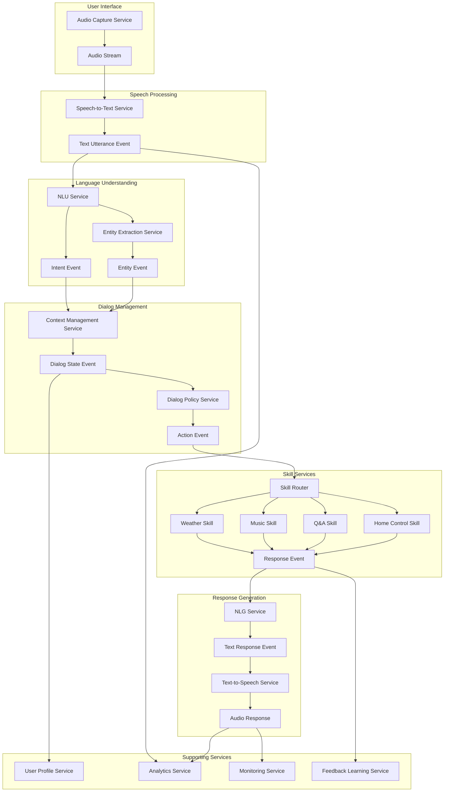

# AI Voice Assistant

A modern voice assistant built with Next.js, WebRTC, and FastAPI. This project enables real-time voice interaction with an AI assistant, featuring low-latency audio streaming, high-quality speech processing, and a responsive UI.

## Features

- **Real-time Voice Communication**: WebRTC for efficient audio capture and streaming
- **Low Latency Processing**: Optimized audio processing pipeline
- **Redis Message Queue**: For reliable communication between frontend and backend
- **Responsive UI**: Modern interface built with TailwindCSS
- **Type Safety**: Written in TypeScript for better development experience
- **Object-Oriented Design**: Clean, testable code architecture
- **Test-Driven Development**: Comprehensive test coverage

## Tech Stack

- **Frontend**: Next.js 15, React 19, TypeScript
- **UI Framework**: TailwindCSS 4
- **Audio Processing**: WebRTC, AudioWorklet API
- **Message Queue**: Redis
- **Backend**: FastAPI (Python)
- **Authentication**: External microservice
- **Testing**: Jest, React Testing Library

## Architecture

The application follows a layered architecture:

1. **Presentation Layer**: React components for UI
2. **Application Layer**: Context providers and hooks for state management
3. **Domain Layer**: Core business logic in services
4. **Infrastructure Layer**: External communication (WebRTC, Redis)

Data flows through the system as follows:

1. User speaks into the microphone
2. Audio is captured and processed via WebRTC
3. Audio chunks are sent to the backend via WebSocket/Redis
4. Backend processes the audio and generates a response
5. Response is streamed back to the frontend
6. UI updates with the response in real-time


### AI Voice Assistant Architecture


## Getting Started

### Prerequisites

- Node.js (v18+)
- Redis server
- FastAPI backend (see separate repository)

### Installation

1. Clone the repository:
   ```
   git clone https://github.com/yourusername/ai-voice-assistant.git
   cd ai-voice-assistant
   ```

2. Install dependencies:
   ```
   npm install
   ```

3. Set up environment variables:
   Create a `.env.local` file with the following variables:
   ```
   # WebRTC configuration
   STUN_SERVERS=stun:stun.l.google.com:19302
   TURN_SERVERS=
   TURN_USERNAME=
   TURN_CREDENTIAL=
   
   # Redis configuration
   REDIS_URL=redis://localhost:6379
   
   # Backend APIs
   API_BASE_URL=http://localhost:8000
   AUTH_SERVICE_URL=http://localhost:8001
   ```

4. Start the development server:
   ```
   npm run dev
   ```

5. Open [http://localhost:3000](http://localhost:3000) in your browser.

### Running Tests

```
npm test
```

To run tests with coverage:

```
npm run test:coverage
```

## Project Structure

```
├── public/                  # Static assets
│   ├── audio-processor.js   # Audio worklet for processing
├── src/
│   ├── app/                 # Next.js app directory
│   ├── components/          # UI components
│   ├── contexts/            # React context providers
│   ├── hooks/               # Custom React hooks
│   ├── lib/                 # Core services
│   │   ├── redis/           # Redis communication
│   │   ├── webrtc/          # WebRTC implementation
│   ├── types/               # TypeScript type definitions
│   └── utils/               # Utility functions
├── .env.local               # Environment variables (create this)
└── next.config.ts           # Next.js configuration
```

## Backend Integration

This frontend is designed to work with a FastAPI backend that:

1. Receives audio chunks via WebSocket
2. Processes speech with a speech-to-text model
3. Generates responses with an LLM
4. Streams responses back to the frontend

Refer to the FastAPI backend repository for setup instructions.

## Future Enhancements

- **Voice Customization**: Different AI voices to choose from
- **Conversation History**: Save and load past conversations
- **Offline Mode**: Basic functionality without internet connection
- **Voice Authentication**: Recognize users by voice print
- **Multi-language Support**: Support for multiple languages

## Contributing

Contributions are welcome! Please feel free to submit a Pull Request.

## License

This project is licensed under the MIT License - see the LICENSE file for details.
